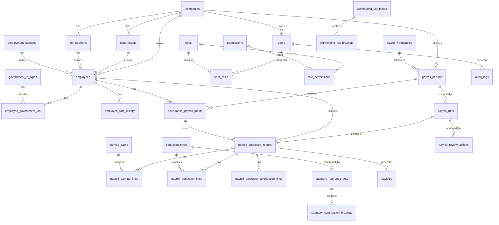

# SME-Pay Database Schema

**System title:** Design and Development of SME-Pay: A Web-Based Payroll Automation System for Visual Options Engineering and Fabrication Services  
**Schema version:** 1.1 corrected  
**Generated:** 2026-05-15  
**Database target:** PostgreSQL / Supabase-compatible relational design  
**Normalization target:** Third Normal Form (3NF)  
**Reference basis:** Revised use-case inventory + detailed analysis report issue-resolution pass

---

## Correction Summary for Version 1.1

This revision applies the database-schema fixes identified during the review pass.

| Issue | Resolution Applied |
|---|---|
| DB-01 | `rest_day_overtime_hours` and `holiday_overtime_hours` are now nullable. `NULL` means not applicable; `0` means confirmed none. |
| DB-02 | Removed `employees.is_record_complete`; employee completeness is derived through `v_incomplete_employee_records`. |
| DB-03 | Removed `statutory_contribution_brackets.total_fixed_amount`; total contribution is computed in `v_contribution_bracket_totals`. |
| DB-04 | Removed approval/finalization duplicate columns from `payroll_periods`; action history tables are authoritative. |
| DB-05 | Added partial unique index for one active document template per company/template type. |
| DB-06 | Added positive-only amount rule for `manual_payroll_adjustments.amount`. |
| DB-07 | Added explicit status-value `CHECK` constraints for enumerated status fields. |
| DB-08 | Added update-audit columns to `employee_government_ids`. |
| DB-09 | Added EAV type-enforcement note for `system_settings`. |

---

## 1. Design Position

This database is designed for the **core prototype** of SME-Pay:

- Payroll Administrator prepares payroll.
- Owner / Manager reviews, returns, approves, and finalizes payroll.
- System Administrator manages users, roles, settings, audit logs, backup, and restore tasks.
- Employee portal is treated as **optional** and placed in a separate section.

The schema avoids hardcoded payroll rates. SSS, PhilHealth, Pag-IBIG, and withholding tax references are stored in **effective-dated reference tables** so that future rate updates can be inserted as new records instead of changing the schema. Official contribution/tax sources should be used as reference data, not as fixed schema structure.

---

## 2. Main Database Principles

### 2.1 Normalization Rules Used

| Normalization Rule | Application in SME-Pay |
|---|---|
| 1NF | Every field stores one value only. No repeating columns such as `sss_1`, `sss_2`, `sss_3`. |
| 2NF | Every non-key field depends on the full primary key. Junction tables are used for many-to-many relationships. |
| 3NF | Non-key fields do not depend on other non-key fields. Lookup tables are separated from transaction tables. |
| Effective dating | Salary rates, contribution tables, tax brackets, templates, and system settings can change over time without overwriting old payroll records. |
| Auditability | Payroll finalization, deduction setting changes, user changes, and corrections are traceable through audit tables. |
| Snapshot logic | Payroll line amounts are stored as transaction facts. Totals such as gross pay, total deductions, and net pay should be computed through views. |

### 2.2 Amount and Date Standards

| Data Type | Rule |
|---|---|
| Money fields | Use `NUMERIC(12,2)` or larger if needed. Do not use floating-point types for currency. |
| Rates / percentages | Use `NUMERIC(8,6)`. Example: 5% is stored as `0.050000`. |
| Dates | Use `DATE` for payroll coverage and `TIMESTAMPTZ` for system events. |
| Status fields | Use lookup tables or constrained text values. |
| Primary keys | Use UUIDs or generated numeric IDs consistently. This schema uses UUID-style names. |

---

## 3. High-Level Entity Groups

| Group | Tables |
|---|---|
| Company and configuration | `companies`, `company_payroll_settings`, `system_settings`, `document_templates` |
| Authentication and access control | `users`, `roles`, `permissions`, `user_roles`, `role_permissions`, `login_attempts`, `password_reset_tokens` |
| Employees and employment records | `employees`, `departments`, `job_positions`, `employment_statuses`, `government_id_types`, `employee_government_ids`, `employee_rate_history` |
| Payroll setup and input | `payroll_frequencies`, `payroll_periods`, `payroll_period_status_history`, `attendance_payroll_inputs`, `manual_adjustment_types`, `manual_payroll_adjustments` |
| Statutory references | `deduction_types`, `statutory_reference_sets`, `statutory_contribution_brackets`, `withholding_tax_tables`, `withholding_tax_brackets` |
| Payroll computation | `payroll_runs`, `payroll_employee_results`, `earning_types`, `payroll_earning_lines`, `payroll_deduction_lines`, `payroll_employer_contribution_lines`, `payroll_review_actions` |
| Output and records | `payslips`, `report_exports`, `backup_files`, `restore_operations`, `archive_logs` |
| Audit and maintenance | `audit_logs`, `system_error_logs` |
| Optional employee portal | `employee_payslip_concerns`, `employee_profile_change_requests`, `notifications` |
| Suggested views | `v_payroll_employee_totals`, `v_payroll_period_summary`, `v_employee_current_rate`, `v_incomplete_employee_records` |

---

## 4. Entity Relationship Overview



---

# 5. Core Table Dictionary

## 5.1 Company and Configuration Tables

### 5.1.1 `companies`

Stores company information used in payslips and reports.

| Column | Type | Key | Required | Notes |
|---|---:|---|---:|---|
| `company_id` | UUID | PK | Yes | Primary identifier. |
| `company_name` | VARCHAR(150) | UQ | Yes | Example: Visual Options Engineering and Fabrication Services. |
| `business_name` | VARCHAR(150) |  | No | Optional trade name. |
| `tin` | VARCHAR(30) |  | No | Company tax identification number. |
| `address_line` | VARCHAR(255) |  | No | Business address. |
| `city` | VARCHAR(100) |  | No | City / municipality. |
| `province` | VARCHAR(100) |  | No | Province. |
| `postal_code` | VARCHAR(20) |  | No | Postal code. |
| `contact_number` | VARCHAR(30) |  | No | Company contact number. |
| `email` | VARCHAR(150) |  | No | Company email. |
| `logo_file_path` | VARCHAR(255) |  | No | Used in payslip/report template. |
| `is_active` | BOOLEAN |  | Yes | Default `TRUE`. |
| `created_at` | TIMESTAMPTZ |  | Yes | Record timestamp. |
| `updated_at` | TIMESTAMPTZ |  | Yes | Record timestamp. |

**Use-case support:** Manage Company Information, Generate Payslips, Generate Payroll Summary Reports.

---

### 5.1.2 `company_payroll_settings`

Stores default payroll configuration for the company.

| Column | Type | Key | Required | Notes |
|---|---:|---|---:|---|
| `payroll_setting_id` | UUID | PK | Yes | Primary identifier. |
| `company_id` | UUID | FK | Yes | References `companies.company_id`. |
| `default_frequency_id` | UUID | FK | Yes | References `payroll_frequencies.frequency_id`. |
| `default_working_days_per_month` | NUMERIC(5,2) |  | Yes | Example: 26.00. |
| `default_working_hours_per_day` | NUMERIC(5,2) |  | Yes | Example: 8.00. |
| `default_overtime_multiplier` | NUMERIC(8,6) |  | Yes | Example: `1.250000` for 125%. |
| `allow_manual_adjustments` | BOOLEAN |  | Yes | Controls manual allowance/deduction feature. |
| `require_manager_approval` | BOOLEAN |  | Yes | Controls approval/finalization workflow. |
| `effective_from` | DATE |  | Yes | Settings start date. |
| `effective_to` | DATE |  | No | Null means current. |
| `created_by_user_id` | UUID | FK | Yes | References `users.user_id`. |
| `created_at` | TIMESTAMPTZ |  | Yes | Record timestamp. |

**3NF note:** Payroll settings are separated from company data because they can change independently over time.

---

### 5.1.3 `system_settings`

Stores technical application settings that do not deserve separate columns.

| Column | Type | Key | Required | Notes |
|---|---:|---|---:|---|
| `setting_id` | UUID | PK | Yes | Primary identifier. |
| `company_id` | UUID | FK | No | Null means global setting. |
| `setting_key` | VARCHAR(100) | UQ* | Yes | Example: `SESSION_TIMEOUT_MINUTES`. |
| `setting_value` | TEXT |  | Yes | Value as text. |
| `value_type` | VARCHAR(30) |  | Yes | `string`, `number`, `boolean`, `json`. |
| `description` | VARCHAR(255) |  | No | Setting explanation. |
| `updated_by_user_id` | UUID | FK | No | References `users.user_id`. |
| `updated_at` | TIMESTAMPTZ |  | Yes | Update timestamp. |

**Constraints:**

- Unique pair `company_id + setting_key`.
- `CHECK (value_type IN ('STRING','NUMBER','BOOLEAN','JSON'))`.

**Design note:** `system_settings` intentionally uses an Entity-Attribute-Value style because settings vary by deployment. The database stores `setting_value` as text and `value_type` as a validation guide. Type conformance must be enforced by the application settings service before insert/update. Direct database writes to this table should be restricted to trusted administrative functions.

---

### 5.1.4 `document_templates`

Stores payslip and report template configuration.

| Column | Type | Key | Required | Notes |
|---|---:|---|---:|---|
| `template_id` | UUID | PK | Yes | Primary identifier. |
| `company_id` | UUID | FK | Yes | References `companies.company_id`. |
| `template_type` | VARCHAR(30) |  | Yes | `PAYSLIP`, `PAYROLL_SUMMARY`, `DEDUCTION_SUMMARY`, `AUDIT_LOG`. |
| `template_name` | VARCHAR(100) |  | Yes | Display name. |
| `version_no` | INTEGER |  | Yes | Version number. |
| `template_config` | JSONB |  | Yes | Layout settings. |
| `is_active` | BOOLEAN |  | Yes | Only one active template per type should be allowed. |
| `created_by_user_id` | UUID | FK | Yes | References `users.user_id`. |
| `created_at` | TIMESTAMPTZ |  | Yes | Record timestamp. |

**Constraints:**

- Unique pair `company_id + template_type + version_no`.
- Only one active template per company/template type:

```sql
CREATE UNIQUE INDEX uix_document_templates_active
ON document_templates (company_id, template_type)
WHERE is_active = TRUE;
```

---

## 5.2 Authentication and Access-Control Tables

### 5.2.1 `users`

Stores login accounts for Payroll Administrator, Owner / Manager, System Administrator, and optional Employee accounts.

| Column | Type | Key | Required | Notes |
|---|---:|---|---:|---|
| `user_id` | UUID | PK | Yes | Primary identifier. |
| `company_id` | UUID | FK | Yes | References `companies.company_id`. |
| `employee_id` | UUID | FK | No | References `employees.employee_id`; nullable for non-employee accounts. |
| `username` | VARCHAR(80) | UQ | Yes | Login username. |
| `email` | VARCHAR(150) | UQ | No | Optional login/recovery email. |
| `password_hash` | VARCHAR(255) |  | Yes | Store hash only, never plaintext. |
| `account_status` | VARCHAR(30) |  | Yes | `ACTIVE`, `LOCKED`, `DISABLED`, `PENDING`. |
| `must_change_password` | BOOLEAN |  | Yes | Default `FALSE`. |
| `last_login_at` | TIMESTAMPTZ |  | No | Last successful login. |
| `created_by_user_id` | UUID | FK | No | Self-reference to `users.user_id`. |
| `created_at` | TIMESTAMPTZ |  | Yes | Record timestamp. |
| `updated_at` | TIMESTAMPTZ |  | Yes | Record timestamp. |

**Use-case support:** Log In / Log Out, Manage User Accounts, Reset User Password, Employee Portal Login.

---

### 5.2.2 `roles`

Stores user role names.

| Column | Type | Key | Required | Notes |
|---|---:|---|---:|---|
| `role_id` | UUID | PK | Yes | Primary identifier. |
| `role_code` | VARCHAR(50) | UQ | Yes | Example: `PAYROLL_ADMIN`, `OWNER_MANAGER`, `SYSTEM_ADMIN`, `EMPLOYEE`. |
| `role_name` | VARCHAR(100) | UQ | Yes | Display name. |
| `description` | VARCHAR(255) |  | No | Role explanation. |
| `is_system_role` | BOOLEAN |  | Yes | Prevents accidental deletion of base roles. |
| `created_at` | TIMESTAMPTZ |  | Yes | Record timestamp. |

---

### 5.2.3 `permissions`

Stores granular permissions.

| Column | Type | Key | Required | Notes |
|---|---:|---|---:|---|
| `permission_id` | UUID | PK | Yes | Primary identifier. |
| `permission_code` | VARCHAR(100) | UQ | Yes | Example: `PAYROLL_COMPUTE`, `AUDIT_VIEW`. |
| `module_name` | VARCHAR(80) |  | Yes | Example: `Payroll`, `Employee`, `Audit`. |
| `action_name` | VARCHAR(80) |  | Yes | Example: `Create`, `View`, `Update`, `Approve`. |
| `description` | VARCHAR(255) |  | No | Permission explanation. |

---

### 5.2.4 `user_roles`

Junction table for users and roles.

| Column | Type | Key | Required | Notes |
|---|---:|---|---:|---|
| `user_id` | UUID | PK/FK | Yes | References `users.user_id`. |
| `role_id` | UUID | PK/FK | Yes | References `roles.role_id`. |
| `assigned_by_user_id` | UUID | FK | No | References `users.user_id`. |
| `assigned_at` | TIMESTAMPTZ |  | Yes | Assignment timestamp. |

**3NF note:** User-role assignment is separated because one user may have multiple roles and one role may belong to multiple users.

---

### 5.2.5 `role_permissions`

Junction table for roles and permissions.

| Column | Type | Key | Required | Notes |
|---|---:|---|---:|---|
| `role_id` | UUID | PK/FK | Yes | References `roles.role_id`. |
| `permission_id` | UUID | PK/FK | Yes | References `permissions.permission_id`. |
| `granted_by_user_id` | UUID | FK | No | References `users.user_id`. |
| `granted_at` | TIMESTAMPTZ |  | Yes | Grant timestamp. |

---

### 5.2.6 `login_attempts`

Stores successful and failed login attempts.

| Column | Type | Key | Required | Notes |
|---|---:|---|---:|---|
| `login_attempt_id` | UUID | PK | Yes | Primary identifier. |
| `user_id` | UUID | FK | No | Nullable if username was invalid. |
| `username_entered` | VARCHAR(80) |  | Yes | Username used. |
| `attempt_status` | VARCHAR(30) |  | Yes | `SUCCESS`, `FAILED`. |
| `failure_reason` | VARCHAR(100) |  | No | Example: `WRONG_PASSWORD`, `LOCKED_ACCOUNT`. |
| `ip_address` | VARCHAR(45) |  | No | IPv4 or IPv6. |
| `user_agent` | TEXT |  | No | Browser/device details. |
| `attempted_at` | TIMESTAMPTZ |  | Yes | Attempt timestamp. |

**Use-case support:** View Failed Login Attempts, Lock Suspicious Account.

---

### 5.2.7 `password_reset_tokens`

Stores password reset requests.

| Column | Type | Key | Required | Notes |
|---|---:|---|---:|---|
| `reset_token_id` | UUID | PK | Yes | Primary identifier. |
| `user_id` | UUID | FK | Yes | References `users.user_id`. |
| `token_hash` | VARCHAR(255) | UQ | Yes | Store token hash only. |
| `requested_at` | TIMESTAMPTZ |  | Yes | Request timestamp. |
| `expires_at` | TIMESTAMPTZ |  | Yes | Expiry timestamp. |
| `used_at` | TIMESTAMPTZ |  | No | Null if unused. |
| `requested_by_user_id` | UUID | FK | No | Admin who initiated reset, if applicable. |

---

## 5.3 Employee and Employment Tables

### 5.3.1 `departments`

Stores company departments or units.

| Column | Type | Key | Required | Notes |
|---|---:|---|---:|---|
| `department_id` | UUID | PK | Yes | Primary identifier. |
| `company_id` | UUID | FK | Yes | References `companies.company_id`. |
| `department_name` | VARCHAR(100) |  | Yes | Example: Fabrication, Engineering, Admin. |
| `is_active` | BOOLEAN |  | Yes | Default `TRUE`. |

**Constraint:** Unique pair `company_id + department_name`.

---

### 5.3.2 `job_positions`

Stores job positions.

| Column | Type | Key | Required | Notes |
|---|---:|---|---:|---|
| `position_id` | UUID | PK | Yes | Primary identifier. |
| `company_id` | UUID | FK | Yes | References `companies.company_id`. |
| `position_title` | VARCHAR(100) |  | Yes | Example: Welder, Driver, Office Staff. |
| `is_active` | BOOLEAN |  | Yes | Default `TRUE`. |

**Constraint:** Unique pair `company_id + position_title`.

---

### 5.3.3 `employment_statuses`

Lookup table for employment status.

| Column | Type | Key | Required | Notes |
|---|---:|---|---:|---|
| `employment_status_id` | UUID | PK | Yes | Primary identifier. |
| `status_code` | VARCHAR(30) | UQ | Yes | `ACTIVE`, `RESIGNED`, `TERMINATED`, `ON_LEAVE`, `INACTIVE`. |
| `status_name` | VARCHAR(80) |  | Yes | Display label. |
| `description` | VARCHAR(255) |  | No | Status explanation. |

---

### 5.3.4 `employees`

Stores employee master records.

| Column | Type | Key | Required | Notes |
|---|---:|---|---:|---|
| `employee_id` | UUID | PK | Yes | Primary identifier. |
| `company_id` | UUID | FK | Yes | References `companies.company_id`. |
| `employee_no` | VARCHAR(50) |  | Yes | Internal employee number. |
| `first_name` | VARCHAR(80) |  | Yes | First name. |
| `middle_name` | VARCHAR(80) |  | No | Middle name. |
| `last_name` | VARCHAR(80) |  | Yes | Last name. |
| `suffix` | VARCHAR(20) |  | No | Jr., Sr., III, etc. |
| `birth_date` | DATE |  | No | Optional but useful for records. |
| `sex` | VARCHAR(20) |  | No | Optional. |
| `civil_status` | VARCHAR(30) |  | No | Optional. |
| `contact_number` | VARCHAR(30) |  | No | Employee contact. |
| `email` | VARCHAR(150) |  | No | Employee email. |
| `address_line` | VARCHAR(255) |  | No | Home address. |
| `department_id` | UUID | FK | No | References `departments.department_id`. |
| `position_id` | UUID | FK | No | References `job_positions.position_id`. |
| `employment_status_id` | UUID | FK | Yes | References `employment_statuses.employment_status_id`. |
| `hire_date` | DATE |  | Yes | Date hired. |
| `separation_date` | DATE |  | No | Date resigned/terminated. |
| `created_by_user_id` | UUID | FK | Yes | References `users.user_id`. |
| `created_at` | TIMESTAMPTZ |  | Yes | Record timestamp. |
| `updated_at` | TIMESTAMPTZ |  | Yes | Record timestamp. |

**Constraint:** Unique pair `company_id + employee_no`.

**Completeness rule:** Employee record completeness is not stored as a column. It is derived through `v_incomplete_employee_records` to avoid stale values when government ID records or required employee fields are changed.

**Use-case support:** Manage Employee Records, View Employee List, View Own Profile.

---

### 5.3.5 `government_id_types`

Lookup table for government ID categories.

| Column | Type | Key | Required | Notes |
|---|---:|---|---:|---|
| `government_id_type_id` | UUID | PK | Yes | Primary identifier. |
| `type_code` | VARCHAR(30) | UQ | Yes | `SSS`, `PHILHEALTH`, `PAGIBIG`, `TIN`. |
| `type_name` | VARCHAR(100) |  | Yes | Display name. |
| `is_required_for_payroll` | BOOLEAN |  | Yes | Used in incomplete-record validation. |

---

### 5.3.6 `employee_government_ids`

Stores government ID numbers per employee.

| Column | Type | Key | Required | Notes |
|---|---:|---|---:|---|
| `employee_government_id` | UUID | PK | Yes | Primary identifier. |
| `employee_id` | UUID | FK | Yes | References `employees.employee_id`. |
| `government_id_type_id` | UUID | FK | Yes | References `government_id_types.government_id_type_id`. |
| `id_number` | VARCHAR(50) |  | Yes | Government ID value. |
| `verified_at` | TIMESTAMPTZ |  | No | Verification timestamp. |
| `verified_by_user_id` | UUID | FK | No | References `users.user_id`. |
| `updated_at` | TIMESTAMPTZ |  | No | Last update timestamp. |
| `updated_by_user_id` | UUID | FK | No | References `users.user_id`; last user who changed the ID record. |

**Constraint:** Unique pair `employee_id + government_id_type_id`.

**Audit rule:** Updates to `id_number` should also write an `audit_logs` entry containing the old value, new value, user, timestamp, and reason.

**3NF note:** ID types are stored in a lookup table to avoid columns like `sss_no`, `philhealth_no`, `pagibig_no`, and `tin_no` becoming schema dependencies.

---

### 5.3.7 `employee_rate_history`

Stores salary/rate history.

| Column | Type | Key | Required | Notes |
|---|---:|---|---:|---|
| `rate_history_id` | UUID | PK | Yes | Primary identifier. |
| `employee_id` | UUID | FK | Yes | References `employees.employee_id`. |
| `pay_basis` | VARCHAR(30) |  | Yes | `MONTHLY`, `DAILY`, `HOURLY`. |
| `rate_amount` | NUMERIC(12,2) |  | Yes | Amount based on `pay_basis`. |
| `effective_from` | DATE |  | Yes | Start date. |
| `effective_to` | DATE |  | No | Null means current. |
| `change_reason` | VARCHAR(255) |  | No | Example: salary increase. |
| `approved_by_user_id` | UUID | FK | No | Owner/Manager approval if required. |
| `created_by_user_id` | UUID | FK | Yes | References `users.user_id`. |
| `created_at` | TIMESTAMPTZ |  | Yes | Record timestamp. |

**Constraint recommendation:** Prevent overlapping effective-date ranges per employee.

**Use-case support:** Manage Employee Salary / Rate Information, Review Updated Employee Rate.

---

## 5.4 Payroll Period and Payroll Input Tables

### 5.4.1 `payroll_frequencies`

Lookup table for payroll frequency.

| Column | Type | Key | Required | Notes |
|---|---:|---|---:|---|
| `frequency_id` | UUID | PK | Yes | Primary identifier. |
| `frequency_code` | VARCHAR(30) | UQ | Yes | `DAILY`, `WEEKLY`, `SEMI_MONTHLY`, `MONTHLY`. |
| `frequency_name` | VARCHAR(80) |  | Yes | Display label. |
| `periods_per_year` | INTEGER |  | No | Optional. |

---

### 5.4.2 `payroll_periods`

Stores payroll periods and cut-off dates.

| Column | Type | Key | Required | Notes |
|---|---:|---|---:|---|
| `payroll_period_id` | UUID | PK | Yes | Primary identifier. |
| `company_id` | UUID | FK | Yes | References `companies.company_id`. |
| `frequency_id` | UUID | FK | Yes | References `payroll_frequencies.frequency_id`. |
| `period_code` | VARCHAR(50) |  | Yes | Example: `2026-05-A`. |
| `period_name` | VARCHAR(100) |  | Yes | Example: May 1st Cut-off 2026. |
| `period_start_date` | DATE |  | Yes | Payroll coverage start. |
| `period_end_date` | DATE |  | Yes | Payroll coverage end. |
| `cutoff_start_date` | DATE |  | Yes | Attendance/input cut-off start. |
| `cutoff_end_date` | DATE |  | Yes | Attendance/input cut-off end. |
| `pay_date` | DATE |  | No | Expected pay release date. |
| `period_status` | VARCHAR(30) |  | Yes | `OPEN`, `COMPUTED`, `SUBMITTED`, `RETURNED`, `FINALIZED`, `REOPENED`, `ARCHIVED`. |
| `created_by_user_id` | UUID | FK | Yes | References `users.user_id`. |
| `created_at` | TIMESTAMPTZ |  | Yes | Record timestamp. |
| `updated_at` | TIMESTAMPTZ |  | Yes | Record timestamp. |

**Constraints:**

- Unique pair `company_id + period_code`.
- `period_end_date >= period_start_date`.
- `cutoff_end_date >= cutoff_start_date`.
- `CHECK (period_status IN ('OPEN','COMPUTED','SUBMITTED','RETURNED','FINALIZED','REOPENED','ARCHIVED'))`.
- Payroll inputs and computations should be locked when `period_status = 'FINALIZED'`.

**Authoritative workflow note:** Approval, finalization, reopening, and return details are authoritative in `payroll_review_actions` and `payroll_period_status_history`. `payroll_periods.period_status` stores only the current status for fast filtering.

---

### 5.4.3 `payroll_period_status_history`

Stores period workflow history.

| Column | Type | Key | Required | Notes |
|---|---:|---|---:|---|
| `status_history_id` | UUID | PK | Yes | Primary identifier. |
| `payroll_period_id` | UUID | FK | Yes | References `payroll_periods.payroll_period_id`. |
| `old_status` | VARCHAR(30) |  | No | Previous status. |
| `new_status` | VARCHAR(30) |  | Yes | New status. |
| `changed_by_user_id` | UUID | FK | Yes | References `users.user_id`. |
| `changed_at` | TIMESTAMPTZ |  | Yes | Status change timestamp. |
| `remarks` | TEXT |  | No | Reason or explanation. |

**Constraints:**

- `CHECK (new_status IN ('OPEN','COMPUTED','SUBMITTED','RETURNED','FINALIZED','REOPENED','ARCHIVED'))`.
- `CHECK (old_status IS NULL OR old_status IN ('OPEN','COMPUTED','SUBMITTED','RETURNED','FINALIZED','REOPENED','ARCHIVED'))`.

**Use-case support:** Submit Payroll for Review, Return Payroll for Correction, Approve / Finalize Payroll, Reopen Finalized Payroll Period.

---

### 5.4.4 `attendance_payroll_inputs`

Stores encoded attendance and payroll input values for each employee per period.

| Column | Type | Key | Required | Notes |
|---|---:|---|---:|---|
| `attendance_input_id` | UUID | PK | Yes | Primary identifier. |
| `payroll_period_id` | UUID | FK | Yes | References `payroll_periods.payroll_period_id`. |
| `employee_id` | UUID | FK | Yes | References `employees.employee_id`. |
| `days_worked` | NUMERIC(6,2) |  | Yes | Number of paid days worked. |
| `regular_hours_worked` | NUMERIC(7,2) |  | No | Useful for hourly computation. |
| `absence_days` | NUMERIC(6,2) |  | Yes | Absence count. |
| `late_minutes` | INTEGER |  | Yes | Total late minutes. |
| `undertime_minutes` | INTEGER |  | Yes | Total undertime minutes. |
| `overtime_hours` | NUMERIC(7,2) |  | Yes | Basic overtime hours. |
| `rest_day_overtime_hours` | NUMERIC(7,2) |  | No | Optional. `NULL` means not applicable; `0` means confirmed no rest-day overtime. |
| `holiday_overtime_hours` | NUMERIC(7,2) |  | No | Optional. `NULL` means not applicable; `0` means confirmed no holiday overtime. |
| `source_type` | VARCHAR(30) |  | Yes | `MANUAL`, `IMPORT`, `CORRECTION`. |
| `input_status` | VARCHAR(30) |  | Yes | `DRAFT`, `VALIDATED`, `CORRECTED`, `LOCKED`. |
| `remarks` | TEXT |  | No | Explanation of input. |
| `encoded_by_user_id` | UUID | FK | Yes | References `users.user_id`. |
| `encoded_at` | TIMESTAMPTZ |  | Yes | Encoding timestamp. |
| `updated_by_user_id` | UUID | FK | No | Last updater. |
| `updated_at` | TIMESTAMPTZ |  | Yes | Last update timestamp. |

**Constraints:**

- Unique pair `payroll_period_id + employee_id`.
- `CHECK (days_worked >= 0)`.
- `CHECK (absence_days >= 0)`.
- `CHECK (late_minutes >= 0)`.
- `CHECK (undertime_minutes >= 0)`.
- `CHECK (overtime_hours >= 0)`.
- `CHECK (rest_day_overtime_hours IS NULL OR rest_day_overtime_hours >= 0)`.
- `CHECK (holiday_overtime_hours IS NULL OR holiday_overtime_hours >= 0)`.
- `CHECK (input_status IN ('DRAFT','VALIDATED','CORRECTED','LOCKED','VOIDED'))`.

**Use-case support:** Encode Attendance / Payroll Inputs, Correct Attendance / Payroll Input, View Own Attendance Summary Used for Payroll.

---

### 5.4.5 `manual_adjustment_types`

Lookup table for manual allowances, additions, and deductions.

| Column | Type | Key | Required | Notes |
|---|---:|---|---:|---|
| `adjustment_type_id` | UUID | PK | Yes | Primary identifier. |
| `adjustment_code` | VARCHAR(50) | UQ | Yes | Example: `MEAL_ALLOWANCE`, `CASH_ADVANCE`. |
| `adjustment_name` | VARCHAR(100) |  | Yes | Display name. |
| `adjustment_class` | VARCHAR(30) |  | Yes | `EARNING` or `DEDUCTION`. |
| `is_taxable` | BOOLEAN |  | Yes | Whether included in taxable income. |
| `is_active` | BOOLEAN |  | Yes | Default `TRUE`. |

**Constraint:** `CHECK (adjustment_class IN ('EARNING','DEDUCTION'))`.

---

### 5.4.6 `manual_payroll_adjustments`

Stores manual payroll adjustments before computation.

| Column | Type | Key | Required | Notes |
|---|---:|---|---:|---|
| `manual_adjustment_id` | UUID | PK | Yes | Primary identifier. |
| `payroll_period_id` | UUID | FK | Yes | References `payroll_periods.payroll_period_id`. |
| `employee_id` | UUID | FK | Yes | References `employees.employee_id`. |
| `adjustment_type_id` | UUID | FK | Yes | References `manual_adjustment_types.adjustment_type_id`. |
| `amount` | NUMERIC(12,2) |  | Yes | Positive amount only; class determines add/deduct. |
| `remarks` | TEXT |  | No | Reason for adjustment. |
| `created_by_user_id` | UUID | FK | Yes | References `users.user_id`. |
| `approved_by_user_id` | UUID | FK | No | Optional manager approval. |
| `created_at` | TIMESTAMPTZ |  | Yes | Record timestamp. |

**Constraints:**

- `CHECK (amount > 0)`.
- Direction is determined by `manual_adjustment_types.adjustment_class`; `amount` stores only the absolute value.

**Use-case support:** Add Manual Allowance, Add Manual Deduction, Add Payroll Adjustment Remarks.

---

## 5.5 Deduction and Statutory Reference Tables

### 5.5.1 `deduction_types`

Stores deduction categories.

| Column | Type | Key | Required | Notes |
|---|---:|---|---:|---|
| `deduction_type_id` | UUID | PK | Yes | Primary identifier. |
| `deduction_code` | VARCHAR(50) | UQ | Yes | `SSS`, `PHILHEALTH`, `PAGIBIG`, `WITHHOLDING_TAX`, `CASH_ADVANCE`, `OTHER`. |
| `deduction_name` | VARCHAR(100) |  | Yes | Display name. |
| `deduction_category` | VARCHAR(30) |  | Yes | `STATUTORY`, `TAX`, `CUSTOM`, `LOAN`, `OTHER`. |
| `calculation_method` | VARCHAR(30) |  | Yes | `BRACKET`, `PERCENTAGE`, `FIXED`, `MANUAL`. |
| `reduces_taxable_income` | BOOLEAN |  | Yes | Mandatory contributions commonly reduce taxable compensation before withholding tax calculation. |
| `has_employer_share` | BOOLEAN |  | Yes | True for some government contributions. |
| `is_active` | BOOLEAN |  | Yes | Default `TRUE`. |

---

### 5.5.2 `statutory_reference_sets`

Stores versioned contribution reference tables.

| Column | Type | Key | Required | Notes |
|---|---:|---|---:|---|
| `reference_set_id` | UUID | PK | Yes | Primary identifier. |
| `deduction_type_id` | UUID | FK | Yes | References `deduction_types.deduction_type_id`. |
| `reference_name` | VARCHAR(150) |  | Yes | Example: SSS Contribution Table Effective Jan 2025. |
| `version_label` | VARCHAR(50) |  | Yes | Example: `2025-01`. |
| `effective_from` | DATE |  | Yes | Start date. |
| `effective_to` | DATE |  | No | Null means current. |
| `source_note` | TEXT |  | No | Reference source note. |
| `is_active` | BOOLEAN |  | Yes | Default `TRUE`. |
| `created_by_user_id` | UUID | FK | Yes | References `users.user_id`. |
| `created_at` | TIMESTAMPTZ |  | Yes | Record timestamp. |

**Constraint recommendation:** Prevent overlapping effective ranges for the same `deduction_type_id`.

---

### 5.5.3 `statutory_contribution_brackets`

Stores contribution brackets or formula ranges.

| Column | Type | Key | Required | Notes |
|---|---:|---|---:|---|
| `contribution_bracket_id` | UUID | PK | Yes | Primary identifier. |
| `reference_set_id` | UUID | FK | Yes | References `statutory_reference_sets.reference_set_id`. |
| `min_compensation` | NUMERIC(12,2) |  | Yes | Lower salary/range bound. |
| `max_compensation` | NUMERIC(12,2) |  | No | Null means no upper limit. |
| `salary_credit` | NUMERIC(12,2) |  | No | Used by SSS-style tables. |
| `employee_rate` | NUMERIC(8,6) |  | No | Percentage if applicable. |
| `employer_rate` | NUMERIC(8,6) |  | No | Percentage if applicable. |
| `employee_fixed_amount` | NUMERIC(12,2) |  | No | Fixed employee share. |
| `employer_fixed_amount` | NUMERIC(12,2) |  | No | Fixed employer share. |
| `formula_note` | TEXT |  | No | Explains computation. |

**Why this table is flexible:**

- SSS can use bracketed salary credit and fixed employee/employer shares.
- PhilHealth can use percentage with salary floor and ceiling.
- Pag-IBIG can use rate and maximum fund salary logic.
- Custom future deductions can be added without structural changes.
- Total contribution amount is computed through `v_contribution_bracket_totals`, not stored in this table.

---

### 5.5.4 `withholding_tax_tables`

Stores versioned withholding tax table headers.

| Column | Type | Key | Required | Notes |
|---|---:|---|---:|---|
| `tax_table_id` | UUID | PK | Yes | Primary identifier. |
| `company_id` | UUID | FK | No | Null means national/default table. |
| `frequency_id` | UUID | FK | Yes | References `payroll_frequencies.frequency_id`. |
| `table_name` | VARCHAR(150) |  | Yes | Example: BIR Withholding Tax Table 2023 Onwards. |
| `effective_from` | DATE |  | Yes | Start date. |
| `effective_to` | DATE |  | No | Null means current. |
| `source_note` | TEXT |  | No | Reference source note. |
| `created_by_user_id` | UUID | FK | Yes | References `users.user_id`. |
| `created_at` | TIMESTAMPTZ |  | Yes | Record timestamp. |

**Constraint recommendation:** Prevent overlapping effective ranges per `frequency_id`.

---

### 5.5.5 `withholding_tax_brackets`

Stores withholding tax bracket rows.

| Column | Type | Key | Required | Notes |
|---|---:|---|---:|---|
| `tax_bracket_id` | UUID | PK | Yes | Primary identifier. |
| `tax_table_id` | UUID | FK | Yes | References `withholding_tax_tables.tax_table_id`. |
| `bracket_no` | INTEGER |  | Yes | Ordering number. |
| `lower_bound` | NUMERIC(12,2) |  | Yes | Compensation range lower bound. |
| `upper_bound` | NUMERIC(12,2) |  | No | Null means no upper limit. |
| `base_tax_amount` | NUMERIC(12,2) |  | Yes | Fixed tax amount for bracket. |
| `excess_over_amount` | NUMERIC(12,2) |  | Yes | Amount to subtract before applying marginal rate. |
| `marginal_rate` | NUMERIC(8,6) |  | Yes | Example: 15% as `0.150000`. |

**Use-case support:** Manage Deduction Settings, Compute Payroll, View Deduction Breakdown.

---

## 5.6 Payroll Computation Tables

### 5.6.1 `payroll_runs`

Stores payroll computation attempts per payroll period.

| Column | Type | Key | Required | Notes |
|---|---:|---|---:|---|
| `payroll_run_id` | UUID | PK | Yes | Primary identifier. |
| `payroll_period_id` | UUID | FK | Yes | References `payroll_periods.payroll_period_id`. |
| `run_number` | INTEGER |  | Yes | 1 for first computation, 2+ for recomputation. |
| `run_status` | VARCHAR(30) |  | Yes | `DRAFT`, `COMPUTED`, `SUBMITTED`, `RETURNED`, `FINALIZED`, `VOIDED`. |
| `computed_by_user_id` | UUID | FK | Yes | References `users.user_id`. |
| `computed_at` | TIMESTAMPTZ |  | Yes | Computation timestamp. |
| `formula_version` | VARCHAR(50) |  | No | Useful if computation code changes. |
| `remarks` | TEXT |  | No | Notes or correction reason. |

**Constraints:**

- Unique pair `payroll_period_id + run_number`.
- `CHECK (run_status IN ('DRAFT','COMPUTED','SUBMITTED','RETURNED','FINALIZED','VOIDED'))`.

**Use-case support:** Compute Payroll, Recompute Payroll After Correction, View Payroll History.

---

### 5.6.2 `payroll_employee_results`

Stores one computed payroll result per employee per payroll run. Amount totals are not stored here; they are computed from payroll line tables through views.

| Column | Type | Key | Required | Notes |
|---|---:|---|---:|---|
| `payroll_employee_result_id` | UUID | PK | Yes | Primary identifier. |
| `payroll_run_id` | UUID | FK | Yes | References `payroll_runs.payroll_run_id`. |
| `employee_id` | UUID | FK | Yes | References `employees.employee_id`. |
| `attendance_input_id` | UUID | FK | Yes | References `attendance_payroll_inputs.attendance_input_id`. |
| `rate_history_id` | UUID | FK | Yes | References `employee_rate_history.rate_history_id`. |
| `computation_status` | VARCHAR(30) |  | Yes | `OK`, `WARNING`, `ERROR`, `VOIDED`. |
| `warning_message` | TEXT |  | No | Example: missing government ID. |
| `computed_at` | TIMESTAMPTZ |  | Yes | Computation timestamp. |

**Constraints:**

- Unique pair `payroll_run_id + employee_id`.
- `CHECK (computation_status IN ('OK','WARNING','ERROR','VOIDED'))`.

---

### 5.6.3 `earning_types`

Lookup table for payroll earning line types.

| Column | Type | Key | Required | Notes |
|---|---:|---|---:|---|
| `earning_type_id` | UUID | PK | Yes | Primary identifier. |
| `earning_code` | VARCHAR(50) | UQ | Yes | `BASIC_PAY`, `OVERTIME_PAY`, `HOLIDAY_PAY`, `ALLOWANCE`, `ADJUSTMENT`. |
| `earning_name` | VARCHAR(100) |  | Yes | Display name. |
| `is_taxable` | BOOLEAN |  | Yes | Whether included in taxable compensation. |
| `is_system_generated` | BOOLEAN |  | Yes | True for formula-generated lines. |
| `is_active` | BOOLEAN |  | Yes | Default `TRUE`. |

---

### 5.6.4 `payroll_earning_lines`

Stores computed earning line items.

| Column | Type | Key | Required | Notes |
|---|---:|---|---:|---|
| `earning_line_id` | UUID | PK | Yes | Primary identifier. |
| `payroll_employee_result_id` | UUID | FK | Yes | References `payroll_employee_results.payroll_employee_result_id`. |
| `earning_type_id` | UUID | FK | Yes | References `earning_types.earning_type_id`. |
| `source_manual_adjustment_id` | UUID | FK | No | References `manual_payroll_adjustments.manual_adjustment_id`. |
| `description` | VARCHAR(150) |  | Yes | Example: Regular basic pay. |
| `quantity` | NUMERIC(10,2) |  | No | Days/hours if applicable. |
| `rate_used` | NUMERIC(12,2) |  | No | Rate used in computation. |
| `amount` | NUMERIC(12,2) |  | Yes | Earning amount. |
| `is_taxable` | BOOLEAN |  | Yes | Snapshot from earning type. |

**Use-case support:** View Payroll Computation Breakdown, Generate Payslips.

---

### 5.6.5 `payroll_deduction_lines`

Stores employee-side deduction line items.

| Column | Type | Key | Required | Notes |
|---|---:|---|---:|---|
| `deduction_line_id` | UUID | PK | Yes | Primary identifier. |
| `payroll_employee_result_id` | UUID | FK | Yes | References `payroll_employee_results.payroll_employee_result_id`. |
| `deduction_type_id` | UUID | FK | Yes | References `deduction_types.deduction_type_id`. |
| `reference_set_id` | UUID | FK | No | References `statutory_reference_sets.reference_set_id`. |
| `contribution_bracket_id` | UUID | FK | No | References `statutory_contribution_brackets.contribution_bracket_id`. |
| `tax_bracket_id` | UUID | FK | No | References `withholding_tax_brackets.tax_bracket_id`. |
| `source_manual_adjustment_id` | UUID | FK | No | References `manual_payroll_adjustments.manual_adjustment_id`. |
| `description` | VARCHAR(150) |  | Yes | Example: SSS employee share. |
| `amount` | NUMERIC(12,2) |  | Yes | Deducted amount. |
| `reduces_taxable_income` | BOOLEAN |  | Yes | Snapshot from deduction type. |

**Use-case support:** View Deduction Breakdown, Generate Deduction Summary Report.

---

### 5.6.6 `payroll_employer_contribution_lines`

Stores employer-side contributions that are not deducted from employee net pay.

| Column | Type | Key | Required | Notes |
|---|---:|---|---:|---|
| `employer_contribution_line_id` | UUID | PK | Yes | Primary identifier. |
| `payroll_employee_result_id` | UUID | FK | Yes | References `payroll_employee_results.payroll_employee_result_id`. |
| `deduction_type_id` | UUID | FK | Yes | References `deduction_types.deduction_type_id`. |
| `reference_set_id` | UUID | FK | No | References `statutory_reference_sets.reference_set_id`. |
| `contribution_bracket_id` | UUID | FK | No | References `statutory_contribution_brackets.contribution_bracket_id`. |
| `description` | VARCHAR(150) |  | Yes | Example: SSS employer share. |
| `amount` | NUMERIC(12,2) |  | Yes | Employer contribution amount. |

**Use-case support:** View Total Employer-Side Contribution Estimate, Generate Deduction Summary Report.

---

### 5.6.7 `payroll_review_actions`

Stores review, return, approval, finalization, and reopening actions.

| Column | Type | Key | Required | Notes |
|---|---:|---|---:|---|
| `review_action_id` | UUID | PK | Yes | Primary identifier. |
| `payroll_run_id` | UUID | FK | Yes | References `payroll_runs.payroll_run_id`. |
| `action_type` | VARCHAR(30) |  | Yes | `SUBMIT`, `REVIEW`, `RETURN`, `APPROVE`, `FINALIZE`, `REOPEN`. |
| `action_by_user_id` | UUID | FK | Yes | References `users.user_id`. |
| `action_at` | TIMESTAMPTZ |  | Yes | Action timestamp. |
| `remarks` | TEXT |  | No | Review/correction note. |

**Constraints:**

- `CHECK (action_type IN ('SUBMIT','REVIEW','RETURN','APPROVE','FINALIZE','REOPEN'))`.

**Use-case support:** Review Payroll Computation, Submit Payroll for Review, Return Payroll for Correction, Approve / Finalize Payroll, Reopen Finalized Payroll Period.

---

## 5.7 Payslip, Report, Backup, and Archive Tables

### 5.7.1 `payslips`

Stores generated payslip records.

| Column | Type | Key | Required | Notes |
|---|---:|---|---:|---|
| `payslip_id` | UUID | PK | Yes | Primary identifier. |
| `payroll_employee_result_id` | UUID | FK | Yes | References `payroll_employee_results.payroll_employee_result_id`. |
| `payslip_no` | VARCHAR(80) | UQ | Yes | Unique payslip number. |
| `template_id` | UUID | FK | No | References `document_templates.template_id`. |
| `file_path` | VARCHAR(255) |  | No | PDF/file location if exported. |
| `file_hash` | VARCHAR(128) |  | No | Integrity check. |
| `payslip_status` | VARCHAR(30) |  | Yes | `GENERATED`, `RELEASED`, `REPLACED`, `VOIDED`. |
| `generated_by_user_id` | UUID | FK | Yes | References `users.user_id`. |
| `generated_at` | TIMESTAMPTZ |  | Yes | Generation timestamp. |
| `released_at` | TIMESTAMPTZ |  | No | Optional release tracking. |

**Constraints:**

- `CHECK (payslip_status IN ('GENERATED','RELEASED','REPLACED','VOIDED'))`.
- Unique `payroll_employee_result_id` for active payslip, unless replaced/voided records are kept.

---

### 5.7.2 `report_exports`

Stores generated report export records.

| Column | Type | Key | Required | Notes |
|---|---:|---|---:|---|
| `report_export_id` | UUID | PK | Yes | Primary identifier. |
| `company_id` | UUID | FK | Yes | References `companies.company_id`. |
| `payroll_period_id` | UUID | FK | No | References `payroll_periods.payroll_period_id`. |
| `payroll_run_id` | UUID | FK | No | References `payroll_runs.payroll_run_id`. |
| `report_type` | VARCHAR(50) |  | Yes | `PAYROLL_SUMMARY`, `DEDUCTION_SUMMARY`, `EMPLOYEE_HISTORY`, `AUDIT_LOG`. |
| `file_format` | VARCHAR(20) |  | Yes | `PDF`, `CSV`, `XLSX`. |
| `file_path` | VARCHAR(255) |  | No | Exported file path. |
| `file_hash` | VARCHAR(128) |  | No | Integrity check. |
| `generated_by_user_id` | UUID | FK | Yes | References `users.user_id`. |
| `generated_at` | TIMESTAMPTZ |  | Yes | Export timestamp. |

---

### 5.7.3 `backup_files`

Stores backup/export records.

| Column | Type | Key | Required | Notes |
|---|---:|---|---:|---|
| `backup_file_id` | UUID | PK | Yes | Primary identifier. |
| `company_id` | UUID | FK | Yes | References `companies.company_id`. |
| `backup_type` | VARCHAR(30) |  | Yes | `FULL`, `PAYROLL_ONLY`, `CONFIG_ONLY`, `AUDIT_ONLY`. |
| `backup_status` | VARCHAR(30) |  | Yes | `STARTED`, `COMPLETED`, `FAILED`. |
| `file_path` | VARCHAR(255) |  | No | Backup file location. |
| `file_hash` | VARCHAR(128) |  | No | Integrity check. |
| `created_by_user_id` | UUID | FK | Yes | References `users.user_id`. |
| `created_at` | TIMESTAMPTZ |  | Yes | Backup timestamp. |
| `remarks` | TEXT |  | No | Backup notes. |

**Use-case support:** Backup System Data, Export / Backup Records.

---

### 5.7.4 `restore_operations`

Stores restore attempts from backup files.

| Column | Type | Key | Required | Notes |
|---|---:|---|---:|---|
| `restore_operation_id` | UUID | PK | Yes | Primary identifier. |
| `backup_file_id` | UUID | FK | Yes | References `backup_files.backup_file_id`. |
| `restore_status` | VARCHAR(30) |  | Yes | `STARTED`, `COMPLETED`, `FAILED`, `CANCELLED`. |
| `reason` | TEXT |  | Yes | Restore reason. |
| `restored_by_user_id` | UUID | FK | Yes | References `users.user_id`. |
| `started_at` | TIMESTAMPTZ |  | Yes | Start timestamp. |
| `completed_at` | TIMESTAMPTZ |  | No | Completion timestamp. |
| `remarks` | TEXT |  | No | Result notes. |

---

### 5.7.5 `archive_logs`

Stores archive and restore-from-archive actions.

| Column | Type | Key | Required | Notes |
|---|---:|---|---:|---|
| `archive_log_id` | UUID | PK | Yes | Primary identifier. |
| `company_id` | UUID | FK | Yes | References `companies.company_id`. |
| `entity_type` | VARCHAR(50) |  | Yes | Example: `PAYROLL_PERIOD`, `PAYSLIP`, `REPORT_EXPORT`. |
| `entity_id` | UUID |  | Yes | ID of archived/restored record. |
| `archive_action` | VARCHAR(30) |  | Yes | `ARCHIVE`, `RESTORE`. |
| `action_by_user_id` | UUID | FK | Yes | References `users.user_id`. |
| `action_at` | TIMESTAMPTZ |  | Yes | Action timestamp. |
| `remarks` | TEXT |  | No | Reason. |

---

## 5.8 Audit and Maintenance Tables

### 5.8.1 `audit_logs`

Stores important system actions.

| Column | Type | Key | Required | Notes |
|---|---:|---|---:|---|
| `audit_log_id` | UUID | PK | Yes | Primary identifier. |
| `company_id` | UUID | FK | Yes | References `companies.company_id`. |
| `user_id` | UUID | FK | No | User who performed action; nullable for system action. |
| `action_code` | VARCHAR(80) |  | Yes | Example: `PAYROLL_FINALIZED`, `USER_ROLE_CHANGED`. |
| `entity_type` | VARCHAR(80) |  | Yes | Table/module affected. |
| `entity_id` | UUID |  | No | Affected record ID. |
| `old_values` | JSONB |  | No | Before values. |
| `new_values` | JSONB |  | No | After values. |
| `ip_address` | VARCHAR(45) |  | No | IPv4 or IPv6. |
| `user_agent` | TEXT |  | No | Browser/device. |
| `created_at` | TIMESTAMPTZ |  | Yes | Audit timestamp. |

**Use-case support:** View Audit Logs, Export Audit Logs, Trace Audit Log.

---

### 5.8.2 `system_error_logs`

Stores operational errors.

| Column | Type | Key | Required | Notes |
|---|---:|---|---:|---|
| `system_error_log_id` | UUID | PK | Yes | Primary identifier. |
| `company_id` | UUID | FK | No | Null if global error. |
| `user_id` | UUID | FK | No | User affected, if any. |
| `error_code` | VARCHAR(80) |  | No | Application error code. |
| `error_message` | TEXT |  | Yes | Error description. |
| `error_context` | JSONB |  | No | Route/module/request context. |
| `severity` | VARCHAR(30) |  | Yes | `LOW`, `MEDIUM`, `HIGH`, `CRITICAL`. |
| `is_resolved` | BOOLEAN |  | Yes | Default `FALSE`. |
| `resolved_by_user_id` | UUID | FK | No | References `users.user_id`. |
| `resolved_at` | TIMESTAMPTZ |  | No | Resolution timestamp. |
| `created_at` | TIMESTAMPTZ |  | Yes | Error timestamp. |

---

# 6. Optional Employee Portal Tables

These tables should only be implemented if employee self-service is approved.

## 6.1 `employee_payslip_concerns`

Stores employee concerns about payslips.

| Column | Type | Key | Required | Notes |
|---|---:|---|---:|---|
| `concern_id` | UUID | PK | Yes | Primary identifier. |
| `employee_id` | UUID | FK | Yes | References `employees.employee_id`. |
| `payslip_id` | UUID | FK | Yes | References `payslips.payslip_id`. |
| `concern_type` | VARCHAR(50) |  | Yes | `NET_PAY`, `DEDUCTION`, `OVERTIME`, `ATTENDANCE`, `OTHER`. |
| `description` | TEXT |  | Yes | Employee explanation. |
| `concern_status` | VARCHAR(30) |  | Yes | `SUBMITTED`, `REVIEWING`, `RESOLVED`, `REJECTED`. |
| `submitted_at` | TIMESTAMPTZ |  | Yes | Submission timestamp. |
| `resolved_by_user_id` | UUID | FK | No | Payroll admin/manager. |
| `resolved_at` | TIMESTAMPTZ |  | No | Resolution timestamp. |
| `resolution_notes` | TEXT |  | No | Admin response. |

---

## 6.2 `employee_profile_change_requests`

Stores employee requests to correct own profile.

| Column | Type | Key | Required | Notes |
|---|---:|---|---:|---|
| `profile_change_request_id` | UUID | PK | Yes | Primary identifier. |
| `employee_id` | UUID | FK | Yes | References `employees.employee_id`. |
| `field_name` | VARCHAR(100) |  | Yes | Requested field. |
| `current_value` | TEXT |  | No | Value before request. |
| `requested_value` | TEXT |  | Yes | Proposed value. |
| `request_status` | VARCHAR(30) |  | Yes | `SUBMITTED`, `APPROVED`, `REJECTED`. |
| `submitted_at` | TIMESTAMPTZ |  | Yes | Request timestamp. |
| `reviewed_by_user_id` | UUID | FK | No | References `users.user_id`. |
| `reviewed_at` | TIMESTAMPTZ |  | No | Review timestamp. |
| `review_notes` | TEXT |  | No | Admin note. |

---

## 6.3 `notifications`

Stores optional system notifications.

| Column | Type | Key | Required | Notes |
|---|---:|---|---:|---|
| `notification_id` | UUID | PK | Yes | Primary identifier. |
| `user_id` | UUID | FK | Yes | References `users.user_id`. |
| `notification_type` | VARCHAR(50) |  | Yes | `PAYSLIP_RELEASED`, `PAYROLL_REVIEW`, `CONCERN_UPDATE`, `SYSTEM`. |
| `title` | VARCHAR(150) |  | Yes | Notification title. |
| `message` | TEXT |  | Yes | Notification body. |
| `related_entity_type` | VARCHAR(50) |  | No | Optional. |
| `related_entity_id` | UUID |  | No | Optional. |
| `is_read` | BOOLEAN |  | Yes | Default `FALSE`. |
| `created_at` | TIMESTAMPTZ |  | Yes | Notification timestamp. |
| `read_at` | TIMESTAMPTZ |  | No | Read timestamp. |

---

# 7. Suggested Database Views

Views are useful because they provide totals and summaries without duplicating derived values inside base tables.

## 7.1 `v_employee_current_rate`

Shows the current salary/rate record per employee.

```sql
CREATE VIEW v_employee_current_rate AS
SELECT
    erh.employee_id,
    erh.rate_history_id,
    erh.pay_basis,
    erh.rate_amount,
    erh.effective_from
FROM employee_rate_history erh
WHERE erh.effective_to IS NULL;
```

---

## 7.2 `v_payroll_employee_totals`

Computes gross pay, total deductions, employer contributions, and net pay.

```sql
CREATE VIEW v_payroll_employee_totals AS
SELECT
    per.payroll_employee_result_id,
    per.payroll_run_id,
    per.employee_id,
    COALESCE(SUM(DISTINCT pel.amount), 0) AS gross_pay,
    COALESCE((
        SELECT SUM(pdl.amount)
        FROM payroll_deduction_lines pdl
        WHERE pdl.payroll_employee_result_id = per.payroll_employee_result_id
    ), 0) AS total_deductions,
    COALESCE((
        SELECT SUM(pecl.amount)
        FROM payroll_employer_contribution_lines pecl
        WHERE pecl.payroll_employee_result_id = per.payroll_employee_result_id
    ), 0) AS total_employer_contributions,
    COALESCE((
        SELECT SUM(pel2.amount)
        FROM payroll_earning_lines pel2
        WHERE pel2.payroll_employee_result_id = per.payroll_employee_result_id
    ), 0)
    -
    COALESCE((
        SELECT SUM(pdl2.amount)
        FROM payroll_deduction_lines pdl2
        WHERE pdl2.payroll_employee_result_id = per.payroll_employee_result_id
    ), 0) AS net_pay
FROM payroll_employee_results per
LEFT JOIN payroll_earning_lines pel
    ON pel.payroll_employee_result_id = per.payroll_employee_result_id
GROUP BY per.payroll_employee_result_id, per.payroll_run_id, per.employee_id;
```

**Implementation note:** In production, simplify this using CTEs or materialized views if performance becomes an issue.

---

## 7.3 `v_payroll_period_summary`

Summarizes payroll by period and run.

```sql
CREATE VIEW v_payroll_period_summary AS
SELECT
    pp.payroll_period_id,
    pp.period_code,
    pp.period_name,
    pr.payroll_run_id,
    pr.run_number,
    pr.run_status,
    COUNT(vpet.employee_id) AS employee_count,
    SUM(vpet.gross_pay) AS total_gross_pay,
    SUM(vpet.total_deductions) AS total_deductions,
    SUM(vpet.total_employer_contributions) AS total_employer_contributions,
    SUM(vpet.net_pay) AS total_net_pay
FROM payroll_periods pp
JOIN payroll_runs pr
    ON pr.payroll_period_id = pp.payroll_period_id
JOIN v_payroll_employee_totals vpet
    ON vpet.payroll_run_id = pr.payroll_run_id
GROUP BY
    pp.payroll_period_id,
    pp.period_code,
    pp.period_name,
    pr.payroll_run_id,
    pr.run_number,
    pr.run_status;
```

---

## 7.4 `v_incomplete_employee_records`

Flags employees with missing payroll-critical government IDs or missing current rates.

```sql
CREATE VIEW v_incomplete_employee_records AS
SELECT
    e.employee_id,
    e.employee_no,
    e.first_name,
    e.last_name,
    CASE
        WHEN cr.rate_history_id IS NULL THEN TRUE
        WHEN EXISTS (
            SELECT 1
            FROM government_id_types git
            WHERE git.is_required_for_payroll = TRUE
              AND NOT EXISTS (
                  SELECT 1
                  FROM employee_government_ids egid
                  WHERE egid.employee_id = e.employee_id
                    AND egid.government_id_type_id = git.government_id_type_id
              )
        ) THEN TRUE
        ELSE FALSE
    END AS has_missing_payroll_data
FROM employees e
LEFT JOIN v_employee_current_rate cr
    ON cr.employee_id = e.employee_id;
```

---

# 8. Recommended Seed Data

## 8.1 Roles

| Role Code | Role Name |
|---|---|
| `PAYROLL_ADMIN` | Payroll Administrator |
| `OWNER_MANAGER` | Owner / Manager |
| `SYSTEM_ADMIN` | System Administrator |
| `EMPLOYEE` | Employee |

---

## 8.2 Payroll Frequencies

| Frequency Code | Frequency Name |
|---|---|
| `DAILY` | Daily |
| `WEEKLY` | Weekly |
| `SEMI_MONTHLY` | Semi-monthly |
| `MONTHLY` | Monthly |

---

## 8.3 Employment Statuses

| Status Code | Status Name |
|---|---|
| `ACTIVE` | Active |
| `RESIGNED` | Resigned |
| `TERMINATED` | Terminated |
| `ON_LEAVE` | On Leave |
| `INACTIVE` | Inactive |

---

## 8.4 Government ID Types

| Type Code | Type Name | Required for Payroll |
|---|---|---:|
| `SSS` | Social Security System Number | Yes |
| `PHILHEALTH` | PhilHealth Identification Number | Yes |
| `PAGIBIG` | Pag-IBIG MID Number | Yes |
| `TIN` | Tax Identification Number | Yes |

---

## 8.5 Deduction Types

| Deduction Code | Deduction Name | Category | Calculation Method | Has Employer Share |
|---|---|---|---|---:|
| `SSS` | SSS Contribution | `STATUTORY` | `BRACKET` | Yes |
| `PHILHEALTH` | PhilHealth Contribution | `STATUTORY` | `PERCENTAGE` | Yes |
| `PAGIBIG` | Pag-IBIG Contribution | `STATUTORY` | `PERCENTAGE` | Yes |
| `WITHHOLDING_TAX` | Withholding Tax on Compensation | `TAX` | `BRACKET` | No |
| `CASH_ADVANCE` | Cash Advance | `LOAN` | `MANUAL` | No |
| `OTHER_DEDUCTION` | Other Deduction | `OTHER` | `MANUAL` | No |

---

## 8.6 Earning Types

| Earning Code | Earning Name | Taxable |
|---|---|---:|
| `BASIC_PAY` | Basic Pay | Yes |
| `OVERTIME_PAY` | Overtime Pay | Yes |
| `HOLIDAY_PAY` | Holiday Pay | Yes |
| `ALLOWANCE_TAXABLE` | Taxable Allowance | Yes |
| `ALLOWANCE_NONTAXABLE` | Non-taxable Allowance | No |
| `MANUAL_EARNING_ADJUSTMENT` | Manual Earning Adjustment | Depends on adjustment |

---

# 9. Main Relationships and Cardinalities

| Parent Table | Child Table | Relationship |
|---|---|---|
| `companies` | `employees` | One company has many employees. |
| `companies` | `users` | One company has many user accounts. |
| `users` | `user_roles` | One user can have many roles. |
| `roles` | `role_permissions` | One role can have many permissions. |
| `employees` | `employee_government_ids` | One employee can have many government IDs. |
| `employees` | `employee_rate_history` | One employee can have many historical rates. |
| `payroll_periods` | `attendance_payroll_inputs` | One period has one input record per employee. |
| `payroll_periods` | `payroll_runs` | One period can have multiple computation runs due to corrections. |
| `payroll_runs` | `payroll_employee_results` | One run includes many employee payroll results. |
| `payroll_employee_results` | `payroll_earning_lines` | One employee result has many earning lines. |
| `payroll_employee_results` | `payroll_deduction_lines` | One employee result has many deduction lines. |
| `payroll_employee_results` | `payslips` | One employee result can generate one active payslip. |
| `deduction_types` | `statutory_reference_sets` | One deduction type can have many reference versions. |
| `statutory_reference_sets` | `statutory_contribution_brackets` | One reference version has many brackets. |
| `withholding_tax_tables` | `withholding_tax_brackets` | One tax table version has many tax brackets. |

---

# 10. Use-Case to Table Mapping

| Use Case | Main Tables Used |
|---|---|
| Log In / Log Out | `users`, `roles`, `user_roles`, `login_attempts` |
| Manage User Accounts and Roles | `users`, `roles`, `permissions`, `user_roles`, `role_permissions`, `audit_logs` |
| Manage Company Information | `companies`, `company_payroll_settings`, `document_templates`, `audit_logs` |
| Manage Employee Records | `employees`, `departments`, `job_positions`, `employment_statuses`, `employee_government_ids`, `employee_rate_history`, `audit_logs` |
| Manage Payroll Periods and Cut-off Dates | `payroll_periods`, `payroll_period_status_history`, `audit_logs` |
| Encode Attendance / Payroll Inputs | `attendance_payroll_inputs`, `manual_payroll_adjustments`, `audit_logs` |
| Manage Deduction Settings | `deduction_types`, `statutory_reference_sets`, `statutory_contribution_brackets`, `withholding_tax_tables`, `withholding_tax_brackets`, `audit_logs` |
| Compute Payroll | `payroll_runs`, `payroll_employee_results`, `payroll_earning_lines`, `payroll_deduction_lines`, `payroll_employer_contribution_lines` |
| Review Payroll Computation / View Breakdown | `payroll_employee_results`, `payroll_earning_lines`, `payroll_deduction_lines`, `payroll_employer_contribution_lines`, `v_payroll_employee_totals` |
| Submit Payroll for Review | `payroll_runs`, `payroll_periods`, `payroll_review_actions`, `payroll_period_status_history`, `audit_logs` |
| Approve / Finalize Payroll | `payroll_runs`, `payroll_periods`, `payroll_review_actions`, `payroll_period_status_history`, `audit_logs`, `v_payroll_period_finalization` |
| Reopen Finalized Payroll Period | `payroll_periods`, `payroll_review_actions`, `payroll_period_status_history`, `audit_logs` |
| Generate Payslips | `payslips`, `document_templates`, `payroll_employee_results`, `payroll_earning_lines`, `payroll_deduction_lines` |
| Generate Payroll Summary Reports | `report_exports`, `v_payroll_period_summary` |
| View Payroll History | `payroll_periods`, `payroll_runs`, `payroll_employee_results`, `payslips` |
| Export / Backup Records | `report_exports`, `backup_files` |
| Restore Backup | `backup_files`, `restore_operations`, `audit_logs` |
| View Audit Logs | `audit_logs` |
| Change Own Password | `users`, `password_reset_tokens`, `audit_logs` |
| Submit Payslip Concern | `employee_payslip_concerns`, `payslips`, `notifications` |

---

# 11. Payroll Computation Logic Supported by the Schema

## 11.1 Basic Computation Flow

1. Select an `OPEN` payroll period.
2. Validate employee records through `v_incomplete_employee_records`.
3. Encode payroll inputs in `attendance_payroll_inputs`.
4. Add manual allowances/deductions in `manual_payroll_adjustments`, if allowed.
5. Retrieve current employee rate from `employee_rate_history`.
6. Retrieve current statutory reference sets by effective date.
7. Create a new `payroll_runs` record.
8. Create one `payroll_employee_results` record per included employee.
9. Insert computed earning lines into `payroll_earning_lines`.
10. Insert employee-side deductions into `payroll_deduction_lines`.
11. Insert employer-side contribution lines into `payroll_employer_contribution_lines`.
12. Use `v_payroll_employee_totals` to display gross pay, total deductions, and net pay.
13. Submit, review, approve, and finalize using `payroll_review_actions` and `payroll_period_status_history`.
14. Generate payslips from finalized or approved payroll results.

---

## 11.2 Net Pay Formula

The schema supports this formula through the payroll line tables:

```text
Gross Pay = SUM(payroll_earning_lines.amount)

Total Employee Deductions = SUM(payroll_deduction_lines.amount)

Net Pay = Gross Pay - Total Employee Deductions
```

Employer-side contributions are stored separately:

```text
Total Employer Contributions = SUM(payroll_employer_contribution_lines.amount)
```

This separation prevents employer contributions from accidentally reducing employee net pay.

---

# 12. 3NF Validation Summary

| Area | 3NF Treatment |
|---|---|
| Users and roles | Many-to-many relationship is separated into `user_roles`. |
| Roles and permissions | Many-to-many relationship is separated into `role_permissions`. |
| Employees and government IDs | ID types are stored once in `government_id_types`; employee values are stored in `employee_government_ids`. |
| Employee salary changes | Rate history is separated from employee master data. |
| Payroll period and payroll computation | Payroll period setup is separated from computation runs. |
| Computed payroll result | Result header is separated from earning, deduction, and employer contribution lines. |
| Deduction settings | Deduction types are separated from versioned reference sets and brackets. |
| Tax brackets | Tax table headers are separated from bracket rows. |
| Payslip output | Payslip file metadata is separated from payroll computation data. |
| Reports and exports | Report export metadata is separated from payroll records. |
| Audit logs | Audit history is separated from operational records. |

---

# 13. Important Implementation Constraints

## 13.1 Hard Constraints

| Rule | Recommended Enforcement |
|---|---|
| One attendance input per employee per payroll period | Unique constraint on `attendance_payroll_inputs(payroll_period_id, employee_id)`. |
| One payroll result per employee per payroll run | Unique constraint on `payroll_employee_results(payroll_run_id, employee_id)`. |
| No payroll input edits after finalization | Application rule + database trigger. |
| No overlapping salary rates per employee | Database exclusion constraint or application validation. |
| No overlapping statutory reference sets per deduction type | Application validation or database exclusion constraint. |
| Finalized payroll should not be deleted | Soft delete/archive only. |
| Password must never be stored as plaintext | Store only `password_hash`. |
| Audit log should be append-only | Restrict update/delete permissions. |
| One active document template per company/template type | Partial unique index on `document_templates(company_id, template_type) WHERE is_active = TRUE`. |
| Status fields must use allowed values only | Database `CHECK` constraints on status fields. |
| Manual adjustment amount must be positive | `CHECK (amount > 0)`. |

---

## 13.2 Status and Integrity CHECK Constraints

The following constraints should be represented in migration files or database DDL.

```sql
ALTER TABLE payroll_periods
ADD CONSTRAINT chk_payroll_period_status
CHECK (period_status IN ('OPEN','COMPUTED','SUBMITTED','RETURNED','FINALIZED','REOPENED','ARCHIVED'));

ALTER TABLE payroll_runs
ADD CONSTRAINT chk_payroll_run_status
CHECK (run_status IN ('DRAFT','COMPUTED','SUBMITTED','RETURNED','FINALIZED','VOIDED'));

ALTER TABLE payroll_employee_results
ADD CONSTRAINT chk_payroll_employee_result_status
CHECK (computation_status IN ('OK','WARNING','ERROR','VOIDED'));

ALTER TABLE attendance_payroll_inputs
ADD CONSTRAINT chk_attendance_input_status
CHECK (input_status IN ('DRAFT','VALIDATED','CORRECTED','LOCKED','VOIDED'));

ALTER TABLE payslips
ADD CONSTRAINT chk_payslip_status
CHECK (payslip_status IN ('GENERATED','RELEASED','REPLACED','VOIDED'));

ALTER TABLE payroll_review_actions
ADD CONSTRAINT chk_review_action_type
CHECK (action_type IN ('SUBMIT','REVIEW','RETURN','APPROVE','FINALIZE','REOPEN'));

ALTER TABLE manual_payroll_adjustments
ADD CONSTRAINT chk_manual_adjustment_amount_positive
CHECK (amount > 0);
```

## 13.3 Recommended Indexes

| Table | Index |
|---|---|
| `users` | `username`, `email`, `company_id` |
| `employees` | `company_id`, `employee_no`, `last_name`, `employment_status_id` |
| `employee_government_ids` | `employee_id`, `government_id_type_id` |
| `employee_rate_history` | `employee_id`, `effective_from`, `effective_to` |
| `payroll_periods` | `company_id`, `period_code`, `period_status`, `period_start_date`, `period_end_date` |
| `attendance_payroll_inputs` | `payroll_period_id`, `employee_id` |
| `payroll_runs` | `payroll_period_id`, `run_status` |
| `payroll_employee_results` | `payroll_run_id`, `employee_id` |
| `payroll_earning_lines` | `payroll_employee_result_id`, `earning_type_id` |
| `payroll_deduction_lines` | `payroll_employee_result_id`, `deduction_type_id` |
| `payslips` | `payslip_no`, `payroll_employee_result_id`, `payslip_status` |
| `audit_logs` | `company_id`, `user_id`, `action_code`, `entity_type`, `created_at` |
| `document_templates` | Partial unique index on `company_id`, `template_type` where `is_active = TRUE` |

---

# 14. Tables Excluded on Purpose

| Excluded Table / Feature | Reason |
|---|---|
| Bank transfer tables | Bank salary transfer is outside the approved core scope. |
| Official government remittance filing tables | The system is for internal payroll preparation, not official SSS/PhilHealth/Pag-IBIG filing. |
| BIR e-filing tables | BIR e-filing is outside scope. |
| Biometric device tables | Biometric timekeeping integration is outside scope. |
| Full HRIS modules | Recruitment, training, appraisal, and full leave management are outside scope. |
| Accounting ledger tables | SME-Pay is not a complete accounting system. |

---

# 15. Suggested Minimum Prototype Tables

If the prototype must be reduced, implement these first:

1. `companies`
2. `users`
3. `roles`
4. `permissions`
5. `user_roles`
6. `role_permissions`
7. `employees`
8. `departments`
9. `job_positions`
10. `employment_statuses`
11. `government_id_types`
12. `employee_government_ids`
13. `employee_rate_history`
14. `payroll_frequencies`
15. `payroll_periods`
16. `attendance_payroll_inputs`
17. `deduction_types`
18. `statutory_reference_sets`
19. `statutory_contribution_brackets`
20. `withholding_tax_tables`
21. `withholding_tax_brackets`
22. `payroll_runs`
23. `payroll_employee_results`
24. `earning_types`
25. `payroll_earning_lines`
26. `payroll_deduction_lines`
27. `payroll_employer_contribution_lines`
28. `payslips`
29. `report_exports`
30. `audit_logs`

This minimum set already supports employee records, payroll periods, attendance inputs, deduction settings, computation, payslips, reports, and audit logs.

---

# 16. Final Recommended Schema Size

| Scope | Table Count | Recommendation |
|---|---:|---|
| Minimum working prototype | 30 tables | Best for Chapter 3 and thesis prototype implementation. |
| Strong core system | 37 tables | Includes backup, restore, templates, login attempts, and error logs. |
| Extended with employee portal | 40 tables | Add employee concerns, profile change requests, and notifications. |

**Recommended for SME-Pay:** Use the **strong core system** for the database design chapter, then mark the employee portal tables as optional/future enhancement unless the prototype will actually implement employee login.


---

# 17. External Reference Notes

The database design does not hardcode current statutory values. Instead, statutory values should be inserted into effective-dated reference tables from official or authoritative reference documents during implementation/testing.

| Reference Area | Database Treatment |
|---|---|
| SSS contribution schedules | Store as rows in `statutory_reference_sets` and `statutory_contribution_brackets`. |
| PhilHealth premium schedule | Store salary floor, ceiling, rate, and employee/employer shares in statutory reference rows. |
| Pag-IBIG contribution references | Store as statutory reference rows with effective dates. |
| BIR withholding tax tables | Store as `withholding_tax_tables` and `withholding_tax_brackets`. |
| PostgreSQL integrity mechanisms | Use `CHECK` constraints and partial unique indexes in migration scripts. |

---

# 18. Issue-Resolution Checklist

| Issue | Status |
|---|---|
| DB-01 nullable rest-day/holiday overtime | Fixed. |
| DB-02 derived `employees.is_record_complete` | Fixed by removing column and relying on view. |
| DB-03 derived `total_fixed_amount` | Fixed by removing column and adding `v_contribution_bracket_totals`. |
| DB-04 duplicated approval/finalization fields | Fixed by removing fields from `payroll_periods` and adding finalization view. |
| DB-05 active document-template uniqueness | Fixed through partial unique index. |
| DB-06 positive-only manual adjustment amount | Fixed through `CHECK (amount > 0)`. |
| DB-07 missing status constraints | Fixed through explicit `CHECK` constraints. |
| DB-08 government ID update audit | Fixed by adding `updated_at` and `updated_by_user_id`. |
| DB-09 EAV type enforcement note | Fixed by documenting application-layer validation and adding allowed `value_type` values. |

*End of revised schema.*
