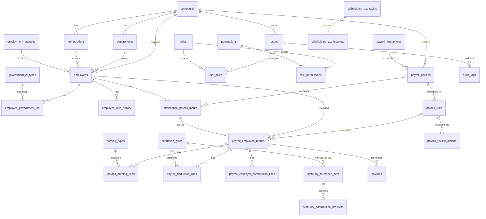

# SME-Pay Master Build Checklist for Antigravity

**System:** SME-Pay — Web-Based Payroll Automation System for Visual Options Engineering and Fabrication Services  
**Repo:** `https://github.com/ace444081/SME.git`  
**Target stack:** Next.js App Router + TypeScript + Tailwind CSS + Supabase PostgreSQL + Supabase Auth + Vercel  
**Build mode:** Solo developer assisted by Google Antigravity  
**Checklist version:** 2.0 aligned  
**Generated:** 2026-05-16  
**Purpose:** One master implementation guide that merges the corrected build checklist, alignment feedback, revised use-case inventory, and revised 3NF database schema.

---

## 0. How Antigravity Must Use This File

This file is the implementation authority for SME-Pay. Antigravity must follow it in order.

### 0.0 Source Documents Merged

| Source file | How it was used |
|---|---|
| `SME-Pay_Full_Build_Checklist(1).md` | Base implementation checklist. |
| `SME-Pay_Checklist_Alignment_Feedback(1).md` | Correction source for scope, RBAC, migration, payslip, audit, and locking issues. |
| `SME-Pay_Database_Schema_3NF_REVISED(1).md` | Embedded as the schema authority in Appendix A. |
| `SME-Pay_Use_Case_Inventory_REVISED(1).md` | Used to align phases with actors and use cases. |

### 0.1 External Implementation References Checked

These are not business requirements, but they guide current implementation choices:

| Area | Official reference used | Implementation impact |
|---|---|---|
| Next.js App Router | `https://nextjs.org/docs/app` | Use App Router, server components, route handlers, and server actions where appropriate. |
| Next.js environment variables | `https://nextjs.org/docs/app/guides/environment-variables` | Only variables prefixed with `NEXT_PUBLIC_` are browser-exposed; service keys must stay server-only. |
| Supabase Auth with SSR / Next.js | `https://supabase.com/docs/guides/auth/server-side` and `https://supabase.com/docs/guides/auth/quickstarts/nextjs` | Use cookie-based server-side auth helpers, not localStorage token storage. |
| Supabase RLS | `https://supabase.com/docs/guides/database/postgres/row-level-security` | Enable RLS on exposed tables and enforce role/company scoping in policies. |
| Vercel environment variables | `https://vercel.com/docs/environment-variables` | Store deployment secrets in Vercel project settings; never commit `.env.local`. |

---

## 0.2 Alignment Fixes Already Applied

Antigravity must not undo these corrections.

| Feedback issue | Fix applied in this checklist |
|---|---|
| Missing `system_settings` in migration order | Added to Migration 002 with company/configuration tables. |
| P0/P1 conflicts for export/backup | Split basic P0 report/payslip export from P1 backup/restore. |
| P0/P1 conflict for user management | Added P0-minimal user/role management if `UC-02` remains in the diagram; full UI remains P1. |
| P0/P1 conflict for company info | Seed company profile in P0; basic editable company info is included; full template polish remains P1. |
| Restore backup and reopen finalized payroll ambiguity | Kept as P1 unless the thesis diagram promises full implementation. |
| Payroll Admin audit mismatch | Fixed demo path: full audit logs are viewed by Owner/Manager or System Admin, not Payroll Admin. |
| Payslip “approved or finalized” ambiguity | Official payslips are finalized-run only. No `APPROVED` run status is introduced. |
| Status inconsistency risk | Added payroll-period/payroll-run synchronization rules. |
| App-only finalization lock risk | Added database-level trigger/lock checklist. |

---

## 0.3 Corrected Scope Priority

| Priority | Scope | Build Decision |
|---|---|---|
| P0-core | Login/logout, protected routes, RBAC enforcement, seeded users/roles, employee records, employee government IDs, rate history, payroll periods, attendance/payroll inputs, deduction/statutory references, payroll computation, review, submit, return, finalize, official payslips, payroll summary, payroll history, full audit-log recording, Owner/System Admin audit viewing | Build first |
| P0-support | Seed company info, basic company info view/edit with correct role limits, basic PDF export for payslips and payroll summary, minimal user list/role screen if `UC-02` remains in the main diagram | Build during core or immediately after core works |
| P1 | Full user creation workflow, detailed login-attempt viewer, company templates, report templates, backup/export records, restore backup, reopen finalized period, archive management, CSV export polish, Playwright e2e tests | Build after P0 is stable |
| P2 | Employee portal, payslip concerns, notifications, spreadsheet import, analytics, payroll trends, email payslips | Future enhancement only |
| Out of scope | Bank salary transfer, official government filing, BIR e-filing, biometric integration, full HRIS, full accounting, native mobile app | Do not build for this prototype |

---

## 0.4 Corrected Main Use-Case to Build Priority Map

| UC Code | Use Case | Actor(s) | Implementation priority | Notes for Antigravity |
|---|---|---|---|---|
| UC-01 | Log In / Log Out | All core users | P0-core | Supabase Auth preferred. |
| UC-02 | Manage User Accounts and Roles | System Admin | P0-support / P1 | P0-minimal if shown in Chapter 3 diagram; P1-full polish. |
| UC-03 | Manage Company Information | System Admin, Payroll Admin limited | P0-support / P1 | Seed company in P0; editable screen with role limits; templates later. |
| UC-04 | Manage Employee Records | Payroll Admin | P0-core | Include government IDs and rate history. |
| UC-05 | Manage Payroll Periods and Cut-off Dates | Payroll Admin | P0-core | Must enforce status rules. |
| UC-06 | Encode Attendance / Payroll Inputs | Payroll Admin | P0-core | Rest-day/holiday overtime nullable. |
| UC-07 | Manage Deduction Settings | Payroll Admin, System Admin | P0-core | Effective-dated statutory references; no hardcoded values. |
| UC-08 | Compute Payroll | Payroll Admin | P0-core | Computation engine is risk center. |
| UC-09 | Review Payroll Computation | Payroll Admin, Owner/Manager | P0-core | Show breakdown, warnings, employee results. |
| UC-10 | Approve / Finalize Payroll | Owner/Manager | P0-core | Finalization must lock database records. |
| UC-11 | Generate Payslips | Payroll Admin | P0-core | Official only from finalized period/run. |
| UC-12 | Generate Payroll Summary Reports | Payroll Admin, Owner/Manager | P0-core | Use summary view. |
| UC-13 | View Payroll History | Payroll Admin, Owner/Manager | P0-core | Show previous periods, runs, payslips. |
| UC-14 | Export / Backup Records | Payroll Admin, System Admin | P0-support / P1 | Basic report/payslip export P0; full backup P1. |
| UC-15 | View Audit Logs | Owner/Manager, System Admin | P0-core | Payroll Admin cannot view full audit logs. |
| UC-16 | Submit Payroll for Review | Payroll Admin | P0-core | Required workflow bridge. |
| UC-17 | Restore Backup | System Admin | P1 | Do not promise if not implemented. |
| UC-18 | Reopen Finalized Payroll Period | Owner/Manager, System Admin | P1 | Risky; keep controlled and audited. |
| UC-S01 | Change Own Password | All authenticated users | P0-support | Use Supabase Auth update flow or custom-auth equivalent. |
| UC-S02 | Reset User Password | System Admin | P0-support / P1 | Minimal if UC-02 retained. |
| UC-S03 | View Dashboard | All core users | P0-support | UI/navigation view, not main business logic. |

---

## 0.5 Non-Negotiable Build Rules

- [x] Build vertically: database → auth/RBAC → employee → period → input → computation → review/finalize → output → audit.
- [x] Use the embedded schema in Appendix A as the table/column authority.
- [x] Do not introduce undocumented tables or statuses unless the checklist is updated first.
- [x] Do not add an `APPROVED` payroll run status.
- [x] Do not hardcode SSS, PhilHealth, Pag-IBIG, or withholding tax values in source code.
- [x] Store statutory values as effective-dated reference rows.
- [x] Use server-side validation for payroll computation.
- [x] Never expose Supabase service-role key to the browser.
- [x] Enable RLS on exposed tables.
- [x] Enforce RBAC in server actions/route handlers, not only in the UI.
- [x] Make finalized payroll data immutable except through documented P1 reopening flow.
- [x] Write audit logs for payroll, user, role, settings, deduction, finalization, restore, and system-error actions.
- [x] Commit after every working module.
- [x] Run typecheck, lint, relevant tests, and manual browser verification before marking a phase complete.

---


---

## 0.6 Standard Antigravity Task Contract

Every Antigravity task must follow this format.

### Before coding

Antigravity must output:

```md
Task:
Files expected to change:
Database objects affected:
Use cases affected:
Risks:
Validation plan:
```

### During coding

Antigravity must follow these constraints:

- [x] No destructive commands without explicit human approval.
- [x] No `.env.local` changes.
- [x] No service-role key in client code.
- [x] No schema changes outside `supabase/migrations`.
- [x] No business-logic shortcuts that bypass the payroll engine.
- [x] No UI-only permission checks without server-side permission checks.
- [x] No editing finalized payroll data except through documented reopen flow.

### After coding

Antigravity must output:

```md
Changed files:
Database migrations added:
Seed changes:
Tests run:
Manual browser checks:
Screenshots needed:
Known limitations:
Next recommended task:
```

### Done means done

A task is complete only when:

- [x] Code compiles.
- [x] `npm run typecheck` passes.
- [x] `npm run lint` passes or documented lint exceptions are justified.
- [x] Relevant unit tests pass.
- [x] Relevant manual browser test is completed.
- [x] RBAC was tested with at least one allowed and one blocked role.
- [x] Audit log behavior was verified if the task changes data.
- [x] The database schema still matches Appendix A.

---

## 1. Antigravity Operating Rules

### 1.1 Repository Safety

- [x] Clone the repository locally:

```bash
git clone https://github.com/ace444081/SME.git
cd SME
```

- [x] Create a development branch before using Antigravity:

```bash
git checkout -b feature/sme-pay-core
```

- [x] Do not let Antigravity run destructive commands without review:
  - `rm -rf`
  - database reset commands
  - migration rollback on production
  - commands affecting system drives/folders
  - bulk file deletion
- [x] Keep `.env.local` uncommitted.
- [x] Add `.env.example`.
- [x] Commit after every working module.
- [x] Require Antigravity to produce:
  - task plan
  - changed files list
  - test result
  - screenshot or browser verification for UI work
  - database migration summary for schema work

### 1.2 Required Agent Files

Create these files before asking Antigravity to build features:

- [x] `README.md`
- [x] `AGENTS.md`
- [x] `.gitignore`
- [x] `.env.example`
- [x] `docs/BUILD_CHECKLIST.md`
- [x] `docs/SCHEMA_REFERENCE.md`
- [x] `docs/USE_CASE_REFERENCE.md`
- [x] `docs/PAYROLL_FORMULA_RULES.md`
- [x] `docs/TEST_SCENARIOS.md`

### 1.3 Suggested `AGENTS.md` Content

```md
# SME-Pay Agent Instructions

This repository contains SME-Pay, a payroll automation prototype.

Rules:
1. Do not delete files unless explicitly requested.
2. Do not modify .env files.
3. Do not hardcode Philippine statutory contribution values in source code.
4. Store statutory values as seed/reference rows.
5. Use database migrations for schema changes.
6. Use TypeScript strict mode.
7. Use server-side validation for payroll computation.
8. Do not allow edits to finalized payroll records.
9. Add or update tests when implementing business logic.
10. Before each task, produce a short plan and affected files list.
11. After each task, produce verification steps and known issues.
```

---

## 2. Phase 1 — Project Initialization

### 2.1 Next.js App Setup

- [x] Initialize app in the repo root:

```bash
npx create-next-app@latest . \
  --ts \
  --tailwind \
  --eslint \
  --app \
  --src-dir \
  --import-alias "@/*"
```

- [x] Confirm the app runs:

```bash
npm run dev
```

- [x] Install base dependencies:

```bash
npm install @supabase/supabase-js @supabase/ssr zod react-hook-form @hookform/resolvers
npm install lucide-react date-fns clsx tailwind-merge
npm install jspdf jspdf-autotable papaparse
npm install -D vitest @testing-library/react @testing-library/jest-dom playwright
```

- [x] Add scripts to `package.json`:

```json
{
  "scripts": {
    "dev": "next dev",
    "build": "next build",
    "lint": "next lint",
    "test": "vitest",
    "test:e2e": "playwright test",
    "typecheck": "tsc --noEmit"
  }
}
```

### 2.2 Initial Folder Structure

- [x] Create this structure:

```text
src/
  app/
    (auth)/
      login/
    (dashboard)/
      dashboard/
      employees/
      payroll-periods/
      attendance-inputs/
      deduction-settings/
      payroll-runs/
      payroll-review/
      payslips/
      reports/
      audit-logs/
      settings/
    api/
      exports/
      payslips/
  components/
    layout/
    ui/
    forms/
    tables/
  features/
    auth/
    users/
    employees/
    payroll-periods/
    attendance/
    deductions/
    payroll-computation/
    payroll-review/
    payslips/
    reports/
    audit/
    settings/
  lib/
    supabase/
    auth/
    rbac/
    validation/
    payroll/
    audit/
    utils/
  types/
  tests/
supabase/
  migrations/
  seed/
docs/
```

### 2.3 First Commit

- [x] Commit initialized app:

```bash
git add .
git commit -m "Initialize SME-Pay Next.js project"
```

---

## 3. Phase 2 — Database Foundation

### 3.1 Migration Order

Build migrations in dependency order.

#### Migration 001 — Extensions and Base Utilities

- [x] Enable UUID extension:

```sql
CREATE EXTENSION IF NOT EXISTS "pgcrypto";
```

- [x] Add common `updated_at` trigger function.
- [x] Add helper function for audit insert if needed.

#### Migration 002 — Company, System Settings, and Lookup Tables

- [x] `companies`
- [x] `system_settings`
- [x] `payroll_frequencies`
- [x] `employment_statuses`
- [x] `government_id_types`
- [x] `deduction_types`
- [x] `earning_types`
- [x] `manual_adjustment_types`

#### Migration 003 — Authentication and RBAC

- [x] `users`
- [x] `roles`
- [x] `permissions`
- [x] `user_roles`
- [x] `role_permissions`
- [x] `login_attempts`
- [x] `password_reset_tokens`

Decision gate:

- [x] Decide auth approach:
  - **Recommended practical path:** Supabase Auth handles passwords; `users` table stores app profile, role link, status, and `auth_user_id`.
  - **Strict schema path:** custom server-only auth stores `password_hash`; more work and more security risk.

If using Supabase Auth, adjust `users` table:

```sql
auth_user_id UUID UNIQUE REFERENCES auth.users(id)
```

Then make `password_hash` nullable or remove it from implementation while documenting the deviation.

#### Migration 004 — Employee Records

- [x] `departments`
- [x] `job_positions`
- [x] `employees`
- [x] `employee_government_ids`
- [x] `employee_rate_history`
- [x] Constraint: unique `company_id + employee_no`
- [x] Constraint: unique `employee_id + government_id_type_id`
- [x] Constraint: prevent overlapping employee rate effective ranges

#### Migration 005 — Payroll Setup and Input

- [x] `company_payroll_settings`
- [x] `payroll_periods`
- [x] `payroll_period_status_history`
- [x] `attendance_payroll_inputs`
- [x] `manual_payroll_adjustments`
- [x] Unique: `payroll_period_id + employee_id`
- [x] Check all non-negative time/day fields.
- [x] Make `rest_day_overtime_hours` and `holiday_overtime_hours` nullable.

#### Migration 006 — Statutory References

- [x] `statutory_reference_sets`
- [x] `statutory_contribution_brackets`
- [x] `withholding_tax_tables`
- [x] `withholding_tax_brackets`
- [x] Prevent overlapping effective ranges by deduction type and frequency.

#### Migration 007 — Payroll Computation

- [x] `payroll_runs`
- [x] `payroll_employee_results`
- [x] `payroll_earning_lines`
- [x] `payroll_deduction_lines`
- [x] `payroll_employer_contribution_lines`
- [x] `payroll_review_actions`
- [x] Unique: `payroll_period_id + run_number`
- [x] Unique: `payroll_run_id + employee_id`

#### Migration 008 — Outputs and Reports

- [x] `payslips`
- [x] `report_exports`
- [x] `document_templates`
- [x] Partial unique index: one active document template per company/template type.

#### Migration 009 — Backup, Restore, Archive, Audit, Errors

- [x] `backup_files`
- [x] `restore_operations`
- [x] `archive_logs`
- [x] `audit_logs`
- [x] `system_error_logs`
- [x] Make `audit_logs` append-only through permissions or trigger rules.

#### Migration 010 — Database-Level Finalization Locks and Integrity Triggers

These are required because app-only locking is not enough for payroll data integrity.

- [x] Create trigger function `prevent_finalized_period_input_changes()`.
- [x] Block `INSERT`, `UPDATE`, and `DELETE` on `attendance_payroll_inputs` when the related period is `FINALIZED` or `ARCHIVED`.
- [x] Block `INSERT`, `UPDATE`, and `DELETE` on `manual_payroll_adjustments` when the related period is `FINALIZED` or `ARCHIVED`.
- [x] Block `UPDATE` and `DELETE` on `payroll_employee_results` when the related run or period is `FINALIZED`.
- [x] Block `UPDATE` and `DELETE` on `payroll_earning_lines`, `payroll_deduction_lines`, and `payroll_employer_contribution_lines` when the parent result belongs to a finalized run.
- [x] Block deletion of finalized `payroll_runs`.
- [x] Allow official payslip generation only after finalized status.
- [x] Make `audit_logs` append-only: no normal user can update or delete audit rows.
- [x] Add test SQL scripts proving finalized payroll data cannot be changed directly.

#### Migration 011 — Views

- [x] `v_employee_current_rate`
- [x] `v_payroll_employee_totals`
- [x] `v_payroll_period_summary`
- [x] `v_incomplete_employee_records`
- [x] `v_contribution_bracket_totals`
- [x] Optional: `v_payroll_period_finalization`

### 3.2 Row Level Security

For Supabase:

- [x] Enable RLS on all exposed tables.
- [x] Create policies by role:
  - Payroll Admin: employee/payroll modules.
  - Owner/Manager: payroll review, reports, audit view.
  - System Admin: users, roles, settings, backup/restore, audit.
  - Employee: own records only if portal is implemented.
- [x] Never expose service role key to browser.
- [x] Write service-role operations only in server routes/actions.
- [x] Test each role using separate accounts.

### 3.2.1 Corrected RBAC Permission Matrix

Use this as the implementation target. The UI may hide pages, but server actions must also enforce these permissions.

| Module / Action | Payroll Admin | Owner / Manager | System Admin | Employee |
|---|---:|---:|---:|---:|
| Login/logout | Yes | Yes | Yes | Optional |
| Change own password | Yes | Yes | Yes | Optional |
| Manage users/roles | No | No | P0-minimal / P1-full | No |
| View company info | Yes | Yes | Yes | Optional read-only |
| Edit company info | Limited basic display fields only | No | Yes | No |
| Manage employees | Yes | View only if needed | No unless configured | Own profile only if portal exists |
| Manage employee rates | Yes | View/approve if configured | No unless configured | No |
| Manage payroll periods | Yes | View only | No unless configured | No |
| Encode attendance/payroll inputs | Yes | No | No | No |
| Manage deduction/statutory references | Yes if authorized | View only | Yes | No |
| Compute payroll | Yes | No | No | No |
| Review payroll computation | Yes | Yes | View/support only | Own result only if portal exists |
| Submit payroll for review | Yes | No | No | No |
| Return payroll | No | Yes | No | No |
| Finalize payroll | No | Yes | No | No |
| Generate payslips | Yes after finalization | View/download summary if needed | No unless configured | Own only if portal exists |
| Generate payroll summary | Yes | Yes | No unless configured | No |
| View payroll history | Yes | Yes | No unless configured | Own only if portal exists |
| View full audit logs | No or limited own-module activity only | Yes | Yes | No |
| Backup/export system data | Limited payroll/report exports | No unless configured | Yes | No |
| Restore backup | No | No | P1 only | No |
| Reopen finalized period | Request only | P1 approve/reopen | P1 support/admin override | No |

### 3.3 Seed Data

- [x] Create seed file for:
  - company
  - roles
  - permissions
  - role permissions
  - payroll frequencies
  - employment statuses
  - government ID types
  - earning types
  - deduction types
  - manual adjustment types
  - default payroll settings
  - demo users
  - demo employees
  - demo salary rates

### 3.4 Database Acceptance Criteria

- [x] `npm run typecheck` passes.
- [x] Migrations apply cleanly to a blank database.
- [x] Seed script runs without duplicate conflicts.
- [x] RLS blocks unauthorized reads/writes.
- [x] Views return expected totals.
- [x] Finalized payroll records cannot be edited by normal app actions.

---

## 4. Phase 3 — Authentication and Role Access

### 4.1 Login

- [x] Build `/login`.
- [x] Validate email/username and password.
- [x] Redirect user based on role:
  - Payroll Admin → `/dashboard`
  - Owner/Manager → `/payroll-review`
  - System Admin → `/settings/users`
- [x] Log successful and failed login attempts.
- [x] Add logout action.
- [x] Add protected route middleware.

### 4.2 RBAC

- [x] Implement `requireRole()`.
- [x] Implement `requirePermission()`.
- [x] Add role-aware navigation.
- [x] Hide unauthorized menu items.
- [x] Block unauthorized server actions even if UI is bypassed.
- [x] Add access denied page.

### 4.3 Change Own Password

- [x] Add password update form.
- [x] Validate current password or Supabase session.
- [x] Add audit log entry.
- [x] Add success/failure message.

### 4.4 User Management

P0-minimal if `UC-02 Manage User Accounts and Roles` remains in the main Chapter 3 use-case diagram. P1-full polish after the payroll flow works.

- [x] P0-minimal: list seeded users.
- [x] P0-minimal: show assigned roles.
- [x] P0-minimal: assign/change role for existing user.
- [x] P0-minimal: disable/enable user.
- [x] P0-minimal: reset password through Supabase Auth/admin-safe server route or documented custom-auth flow.
- [x] P1-full: create user from UI.
- [x] P1-full: lock/unlock account.
- [x] P1-full: view login attempts with filters.
- [x] P1-full: audit role changes, resets, disables, and reactivations.

---

## 5. Phase 4 — Core Layout and Dashboards

### 5.1 App Shell

- [x] Sidebar navigation.
- [x] Top bar with current user and role.
- [x] Breadcrumbs.
- [x] Page header pattern.
- [x] Reusable table component.
- [x] Reusable form layout.
- [x] Loading, empty, error, and forbidden states.
- [x] Mobile-responsive layout.

### 5.2 Dashboard

Dashboards are UI views, not main business use cases.

- [x] Payroll Admin dashboard:
  - active employees
  - open payroll periods
  - pending inputs
  - latest computed payroll
  - incomplete employee records
- [x] Owner/Manager dashboard:
  - payroll pending review
  - finalized payroll periods
  - payroll cost summary
  - audit highlights
- [x] System Admin dashboard:
  - user count
  - locked users
  - recent failed login attempts
  - recent system errors
  - backup status

---

## 6. Phase 5 — Company and Settings Module

### 6.1 Company Information

- [x] View company details.
- [x] System Admin can edit all fields.
- [x] Payroll Admin can edit display-only fields if allowed.
- [x] Upload/update logo path or placeholder.
- [x] Audit changes.

### 6.2 Payroll Settings

- [x] Set default payroll frequency.
- [x] Set default working days per month.
- [x] Set default working hours per day.
- [x] Set default overtime multiplier.
- [x] Toggle manual adjustments.
- [x] Toggle manager approval.
- [x] Effective-date settings.
- [x] Prevent overlapping active settings.

### 6.3 System Settings

- [x] List settings.
- [x] Edit settings by type.
- [x] Validate `STRING`, `NUMBER`, `BOOLEAN`, `JSON`.
- [x] Restrict direct edits to trusted admin flow.

---

## 7. Phase 6 — Employee Records Module

### 7.1 Departments and Positions

- [x] Department list.
- [x] Add/edit/deactivate department.
- [x] Position list.
- [x] Add/edit/deactivate position.
- [x] Enforce unique department/position per company.

### 7.2 Employee Master Records

- [x] Employee list with search/filter.
- [x] Add employee.
- [x] View employee profile.
- [x] Edit employee details.
- [x] Deactivate employee.
- [x] Track employment status.
- [x] Validate required fields.
- [x] Audit create/update/deactivate actions.

### 7.3 Government IDs

- [x] Add/update SSS.
- [x] Add/update PhilHealth.
- [x] Add/update Pag-IBIG.
- [x] Add/update TIN.
- [x] Show missing required IDs.
- [x] Audit old and new values.

### 7.4 Employee Rate History

- [x] Add salary/rate record.
- [x] Support `MONTHLY`, `DAILY`, `HOURLY`.
- [x] Set `effective_from`.
- [x] Close previous active rate when new rate starts.
- [x] Prevent overlapping rate ranges.
- [x] Show current rate from view.
- [x] Audit changes.

### 7.5 Incomplete Employee Records

- [x] Build page using `v_incomplete_employee_records`.
- [x] Show missing current rate.
- [x] Show missing government IDs.
- [x] Link to employee profile edit.

---

## 8. Phase 7 — Payroll Period Module

### 8.1 Payroll Period CRUD

- [x] Create payroll period.
- [x] Set period code.
- [x] Set period name.
- [x] Set period start/end.
- [x] Set cutoff start/end.
- [x] Set pay date.
- [x] Default status: `OPEN`.
- [x] Validate end date >= start date.
- [x] Validate cutoff end >= cutoff start.
- [x] Prevent duplicate period code per company.
- [x] Audit changes.

### 8.2 Status Workflow

Allowed current statuses:

```text
OPEN → COMPUTED → SUBMITTED → RETURNED → COMPUTED → SUBMITTED → FINALIZED
FINALIZED → REOPENED → COMPUTED → SUBMITTED → FINALIZED
FINALIZED → ARCHIVED
```

- [x] Status transition service.
- [x] Insert into `payroll_period_status_history` on each transition.
- [x] Reject invalid transitions.
- [x] Lock inputs when `FINALIZED`.
- [x] Show status badge.

### 8.3 Payroll Period and Payroll Run Status Synchronization

Antigravity must implement this rule exactly to prevent inconsistent payroll states.

| Event | Required `payroll_periods.period_status` | Required latest non-void `payroll_runs.run_status` | Required action |
|---|---|---|---|
| Period created | `OPEN` | none | Allow employee/rate/attendance setup. |
| Payroll computed | `COMPUTED` | `COMPUTED` | Create a new run or recompute current returned/reopened run. |
| Payroll submitted | `SUBMITTED` | `SUBMITTED` | Insert `payroll_review_actions` action `SUBMIT`. |
| Payroll returned | `RETURNED` | `RETURNED` | Insert `payroll_review_actions` action `RETURN`; allow correction. |
| Payroll finalized | `FINALIZED` | `FINALIZED` | Insert `payroll_review_actions` action `FINALIZE`; lock period, run, inputs, and official outputs. |
| Payroll reopened | `REOPENED` | prior run remains `FINALIZED`; new correction run starts after recomputation | Insert `REOPEN`; preserve historical finalized run. |
| Payroll archived | `ARCHIVED` | latest finalized run remains `FINALIZED` | Hide from active lists but preserve history. |

Implementation rules:

- [x] Only one latest non-void payroll run should be treated as the active run for a period.
- [x] Older recomputed runs must be marked `VOIDED` or kept as historical but excluded from active totals.
- [x] Official payslips must reference only the finalized employee result rows.
- [x] A period cannot be `FINALIZED` if the latest active run is not `FINALIZED`.
- [x] A run cannot be `FINALIZED` if its parent period is not being finalized in the same transaction.
- [x] Every transition must insert a row in `payroll_period_status_history`.
- [x] Every submit/return/finalize/reopen action must insert a row in `payroll_review_actions`.
- [x] Add tests for invalid mixed states.

---

## 9. Phase 8 — Attendance and Payroll Inputs

### 9.1 Attendance Input Page

- [x] Select payroll period.
- [x] List active employees.
- [x] Encode:
  - days worked
  - regular hours worked
  - absence days
  - late minutes
  - undertime minutes
  - overtime hours
  - rest-day overtime hours
  - holiday overtime hours
  - source type
  - remarks
- [x] Save as draft.
- [x] Validate input.
- [x] Mark as validated.
- [x] Lock after computation/finalization.
- [x] Audit corrections.

### 9.2 Manual Adjustments

- [x] Add manual earning adjustment.
- [x] Add manual deduction adjustment.
- [x] Amount must be positive.
- [x] Direction comes from adjustment type.
- [x] Optional manager approval.
- [x] Audit adjustment creation.

### 9.3 Bulk Encoding

P2, optional.

- [x] Bulk table edit.
- [x] Spreadsheet import.
- [x] Import validation report.
- [x] Rejected rows list.

---

## 10. Phase 9 — Deduction Settings and Statutory References

### 10.1 Deduction Types

- [x] List deduction types.
- [x] View category and calculation method.
- [x] Enable/disable custom deductions.
- [x] Prevent deleting used deduction types.

### 10.2 Reference Sets

- [x] Add SSS reference set.
- [x] Add PhilHealth reference set.
- [x] Add Pag-IBIG reference set.
- [x] Add withholding tax table.
- [x] Set effective dates.
- [x] Prevent overlapping active reference dates.
- [x] Store source note.
- [x] Audit reference changes.

### 10.3 Brackets

- [x] Contribution bracket table editor.
- [x] Tax bracket table editor.
- [x] Validate min/max ranges.
- [x] Validate no gaps or overlaps where required.
- [x] Validate rates and fixed amounts.
- [x] Do not hardcode statutory values in source code.

---

## 11. Phase 10 — Payroll Computation Engine

### 11.1 Payroll Engine Files

- [x] `src/lib/payroll/types.ts`
- [x] `src/lib/payroll/rate.ts`
- [x] `src/lib/payroll/earnings.ts`
- [x] `src/lib/payroll/deductions.ts`
- [x] `src/lib/payroll/tax.ts`
- [x] `src/lib/payroll/contributions.ts`
- [x] `src/lib/payroll/compute-payroll.ts`
- [x] `src/lib/payroll/validate-payroll-inputs.ts`
- [x] `src/lib/payroll/payroll-errors.ts`
- [x] `src/lib/payroll/__tests__/`

### 11.2 Payroll Input Validation

- [x] Payroll period exists.
- [x] Payroll period status is `OPEN`, `RETURNED`, or `REOPENED`.
- [x] Employees are active.
- [x] Each employee has attendance input.
- [x] Each employee has current rate.
- [x] Required government IDs exist or warning is shown.
- [x] Deduction reference sets exist for pay date/period date.
- [x] Tax table exists for payroll frequency.
- [x] No finalized period can be recomputed without reopening.

### 11.3 Basic Pay Rules

Implement rate conversion service:

- [x] Monthly employee:
  - daily rate = monthly rate / default working days per month
  - hourly rate = daily rate / default working hours per day
- [x] Daily employee:
  - daily rate = rate amount
  - hourly rate = daily rate / default working hours per day
- [x] Hourly employee:
  - hourly rate = rate amount
  - daily estimate = hourly rate × default working hours per day
- [x] Basic pay:
  - monthly/daily basis: `days_worked × daily_rate`
  - hourly basis: `regular_hours_worked × hourly_rate`

### 11.4 Attendance Adjustments

- [x] Absence deduction if absences are encoded separately.
- [x] Late deduction:
  - `late_minutes / 60 × hourly_rate`
- [x] Undertime deduction:
  - `undertime_minutes / 60 × hourly_rate`
- [x] Overtime pay:
  - `overtime_hours × hourly_rate × overtime_multiplier`
- [x] Rest-day overtime:
  - only compute if value is not null.
- [x] Holiday overtime:
  - only compute if value is not null.
- [x] Keep formulas configurable enough for future improvement.

### 11.5 Earnings

Insert line records into `payroll_earning_lines`.

- [x] Basic pay line.
- [x] Overtime pay line.
- [x] Rest-day overtime line if applicable.
- [x] Holiday overtime line if applicable.
- [x] Manual taxable allowance line.
- [x] Manual non-taxable allowance line.
- [x] Other earning adjustments.

### 11.6 Employee Deductions

Insert line records into `payroll_deduction_lines`.

- [x] Late deduction.
- [x] Undertime deduction.
- [x] Absence deduction.
- [x] SSS employee share.
- [x] PhilHealth employee share.
- [x] Pag-IBIG employee share.
- [x] Withholding tax.
- [x] Cash advance/manual deduction.
- [x] Other deduction.

### 11.7 Employer Contributions

Insert line records into `payroll_employer_contribution_lines`.

- [x] SSS employer share.
- [x] PhilHealth employer share.
- [x] Pag-IBIG employer share if applicable.
- [x] Make sure employer contribution does not reduce employee net pay.

### 11.8 Net Pay

Do not store net pay as a duplicated base field unless intentionally snapshotting final output.

- [x] Gross pay = sum earning lines.
- [x] Total deductions = sum deduction lines.
- [x] Net pay = gross pay - total deductions.
- [x] Employer contributions = separate sum.

### 11.9 Payroll Run Creation

- [x] Compute next `run_number`.
- [x] Insert `payroll_runs`.
- [x] Insert one `payroll_employee_results` per employee.
- [x] Insert earning, deduction, and employer contribution lines.
- [x] Update period status to `COMPUTED`.
- [x] Add period status history.
- [x] Add audit log.
- [x] Mark previous draft/computed run as `VOIDED` if recomputing.

### 11.10 Payroll Engine Unit Tests

Minimum tests:

- [x] Monthly employee basic pay.
- [x] Daily employee basic pay.
- [x] Hourly employee basic pay.
- [x] Overtime pay.
- [x] Late and undertime deduction.
- [x] Manual earning.
- [x] Manual deduction.
- [x] Statutory bracket lookup.
- [x] Tax bracket lookup.
- [x] Employer contribution excluded from net pay.
- [x] Missing employee rate creates error.
- [x] Missing government ID creates warning.
- [x] Finalized period blocks recompute.
- [x] Returned period allows recompute.

---

## 12. Phase 11 — Review, Submission, Approval, and Finalization

### 12.1 Review Payroll Computation

- [x] Payroll run list.
- [x] Payroll run detail.
- [x] Employee payroll result table.
- [x] Employee computation breakdown modal/page.
- [x] Show:
  - basic pay
  - overtime
  - attendance deductions
  - statutory deductions
  - manual adjustments
  - employer-side contributions
  - net pay
  - warnings/errors
- [x] Owner/Manager read-only review view.
- [x] Payroll Admin review view before submission.

### 12.2 Submit Payroll for Review

- [x] Only Payroll Admin can submit.
- [x] Only computed run can be submitted.
- [x] Block submission if any employee has `ERROR`.
- [x] Allow submission with `WARNING` only if acknowledged.
- [x] Insert `payroll_review_actions` with `SUBMIT`.
- [x] Update run status to `SUBMITTED`.
- [x] Update period status to `SUBMITTED`.
- [x] Add audit log.

### 12.3 Return Payroll for Correction

- [x] Only Owner/Manager can return.
- [x] Required remarks.
- [x] Insert `payroll_review_actions` with `RETURN`.
- [x] Update run status to `RETURNED`.
- [x] Update period status to `RETURNED`.
- [x] Unlock attendance input for correction.
- [x] Add audit log.

### 12.4 Approve / Finalize Payroll

- [x] Only Owner/Manager can finalize.
- [x] Submitted payroll only.
- [x] Required final review confirmation.
- [x] Insert `payroll_review_actions` with `APPROVE` and/or `FINALIZE`.
- [x] Update run status to `FINALIZED`.
- [x] Update period status to `FINALIZED`.
- [x] Lock attendance inputs.
- [x] Prevent edits to:
  - attendance inputs
  - manual adjustments
  - employee result lines
  - payroll run records
- [x] Add audit log.

### 12.5 Reopen Finalized Payroll Period

P1 if time allows.

- [x] Only Owner/Manager or System Admin.
- [x] Required reason.
- [x] Insert `payroll_review_actions` with `REOPEN`.
- [x] Update period status to `REOPENED`.
- [x] Keep finalized run history.
- [x] Require recomputation after correction.
- [x] Add audit log.

---

## 13. Phase 12 — Payslips

### 13.1 Payslip Generation

- [x] Generate official payslips only when `payroll_runs.run_status = 'FINALIZED'` and the parent `payroll_periods.period_status = 'FINALIZED'`.
- [x] Do not create or rely on an `APPROVED` payroll run status unless the schema is explicitly changed.
- [x] Optional preview payslips before finalization must be labeled `DRAFT/PREVIEW` and must not be treated as official records.
- [x] One active payslip per employee result.
- [x] Generate payslip number.
- [x] Use company info.
- [x] Use employee info.
- [x] Use payroll period info.
- [x] Display earning lines.
- [x] Display deduction lines.
- [x] Display gross pay, total deductions, net pay.
- [x] Optional employer contribution section.
- [x] Store payslip metadata.
- [x] Add audit log.

### 13.2 Payslip UI

- [x] Payslip list by period.
- [x] Payslip detail preview.
- [x] Download PDF.
- [x] Print payslip.
- [x] Mark as released, optional.
- [x] Void/replaced payslip handling, optional.

### 13.3 PDF Output

- [x] Implement server-side PDF generation.
- [x] Include company header.
- [x] Include employee details.
- [x] Include payroll period.
- [x] Include earnings table.
- [x] Include deductions table.
- [x] Include totals.
- [x] Include generated timestamp.
- [x] Include file hash if saved.

---

## 14. Phase 13 — Reports, History, Export, Backup

### 14.1 Payroll Summary Report

- [x] Select payroll period.
- [x] Select payroll run.
- [x] Show employee count.
- [x] Show total gross pay.
- [x] Show total deductions.
- [x] Show total net pay.
- [x] Show total employer contributions.
- [x] Export PDF.
- [x] Export CSV.
- [x] Export XLSX if time allows.
- [x] Add report export metadata.

### 14.2 Payroll History

- [x] List payroll periods.
- [x] Filter by date range.
- [x] Filter by status.
- [x] View runs per period.
- [x] View employee result history.
- [x] View generated payslips.
- [x] Read-only for finalized records.

### 14.3 Audit Logs

- [x] Audit log list.
- [x] Filter by user.
- [x] Filter by action.
- [x] Filter by entity.
- [x] Filter by date range.
- [x] View old/new values.
- [x] Export audit log.
- [x] Restrict to Owner/Manager and System Admin.

### 14.4 Backup and Restore

For prototype, keep this simple.

- [x] Export selected records as JSON/CSV.
- [x] Store backup metadata in `backup_files`.
- [x] Add file hash.
- [x] Restore backup only in development/test environment unless fully validated.
- [x] Store restore operation record.
- [x] Add audit log.
- [x] For production-like demo, prefer backup export over destructive restore.

---

## 15. Phase 14 — Optional Employee Portal

Do not build until P0 and P1 are stable.

### 15.1 Employee Portal Tables

- [x] `employee_payslip_concerns`
- [x] `employee_profile_change_requests`
- [x] `notifications`

### 15.2 Employee Features

- [x] Employee login.
- [x] View own profile.
- [x] View own payslip.
- [x] Download own payslip.
- [x] View own payroll history.
- [x] View own attendance summary.
- [x] Submit payslip concern.
- [x] Request profile correction.
- [x] RLS: employee can only access own rows.

---

## 16. Phase 15 — Testing Plan

### 16.1 Unit Tests

- [x] Payroll rate conversion.
- [x] Basic pay calculation.
- [x] Overtime calculation.
- [x] Deduction calculation.
- [x] Tax bracket calculation.
- [x] Employer contribution separation.
- [x] Status transition validation.
- [x] RBAC permission logic.
- [x] Date overlap validation.
- [x] EAV setting type validation.

### 16.2 Integration Tests

- [x] Create employee with rate and government IDs.
- [x] Create payroll period.
- [x] Encode attendance.
- [x] Compute payroll.
- [x] Submit payroll.
- [x] Return payroll.
- [x] Correct input.
- [x] Recompute payroll.
- [x] Finalize payroll.
- [x] Generate payslip.
- [x] Generate payroll summary.
- [x] View audit logs.

### 16.3 E2E Tests

Using Playwright:

- [x] Payroll Admin login flow.
- [x] Owner/Manager login flow.
- [x] System Admin login flow.
- [x] Unauthorized page access blocked.
- [x] Employee record creation.
- [x] Payroll computation full flow.
- [x] Finalized payroll lock verification.
- [x] Payslip PDF generation.
- [x] Report export.

### 16.4 Manual Demo Test Dataset

Create test records:

- [x] 1 company.
- [x] 1 System Admin.
- [x] 1 Payroll Admin.
- [x] 1 Owner/Manager.
- [x] 5 employees:
  - monthly employee
  - daily employee
  - hourly employee
  - employee with overtime
  - employee with missing data warning
- [x] 1 open payroll period.
- [x] 1 returned payroll scenario.
- [x] 1 finalized payroll period.
- [x] 1 generated payslip.

---

## 17. Phase 16 — Security Checklist

### 17.1 Authentication

- [x] No plaintext passwords.
- [x] No service role key in browser.
- [x] Session middleware protects private routes.
- [x] Failed login attempt recorded.
- [x] Disabled/locked users cannot access system.

### 17.2 Authorization

- [x] Every server action checks role/permission.
- [x] RLS policies match access-control matrix.
- [x] Payroll Admin cannot finalize payroll.
- [x] Owner/Manager cannot encode attendance.
- [x] Employee cannot access other employees if portal exists.
- [x] System Admin cannot accidentally compute payroll unless specifically allowed.

### 17.3 Payroll Data Protection

- [x] Finalized payroll records are read-only.
- [x] Audit logs are append-only.
- [x] Government ID changes are audited.
- [x] Deduction settings changes are audited.
- [x] Manual adjustments are audited.
- [x] Export actions are audited.

### 17.4 Input Validation

- [ ] Zod schemas for all forms.
- [ ] Server-side validation duplicated from client-side validation.
- [ ] Numeric values use decimal handling.
- [ ] Money values never use floating-point in database.
- [ ] Status values restricted.
- [ ] Date range validation enforced.

---

## 18. Phase 17 — Deployment Checklist

### 18.1 Vercel Setup

- [ ] Connect GitHub repo to Vercel.
- [ ] Set production branch to `main`.
- [ ] Add environment variables:
  - `NEXT_PUBLIC_SUPABASE_URL`
  - `NEXT_PUBLIC_SUPABASE_ANON_KEY`
  - `SUPABASE_SERVICE_ROLE_KEY`
  - optional export/storage keys
- [ ] Configure build command:

```bash
npm run build
```

- [ ] Configure install command:

```bash
npm install
```

- [ ] Deploy preview branch.
- [ ] Run smoke tests on preview URL.
- [ ] Deploy production only after smoke test passes.

### 18.2 Supabase Setup

- [ ] Create Supabase project.
- [ ] Apply migrations.
- [ ] Apply seed data.
- [ ] Enable RLS.
- [ ] Create storage bucket for payslips/reports if needed.
- [ ] Configure policies for storage access.
- [ ] Create backup/export plan.

### 18.3 Production Smoke Test

- [ ] Login works.
- [ ] Dashboard loads.
- [ ] Employee list loads.
- [ ] Payroll period list loads.
- [ ] Attendance input saves.
- [ ] Payroll computation works.
- [ ] Payroll review works.
- [ ] Finalization locks records.
- [ ] Payslip generates.
- [ ] Report exports.
- [ ] Audit log records actions.

---

## 19. Phase 18 — Documentation and Thesis Support

### 19.1 README

- [x] Project title.
- [x] System description.
- [x] Tech stack.
- [x] Features.
- [x] Setup instructions.
- [x] Environment variables.
- [x] Demo accounts.
- [x] Deployment link.
- [x] Known limitations.

### 19.2 Developer Docs

- [x] Database schema summary.
- [x] Payroll computation rules.
- [x] RBAC matrix.
- [x] API/server actions list.
- [x] Testing guide.
- [x] Deployment guide.
- [x] Backup/restore guide.

### 19.3 Thesis Demo Evidence

- [x] Use-case diagram screenshot.
- [x] ERD screenshot.
- [x] Login screenshot.
- [x] Employee module screenshot.
- [x] Payroll period screenshot.
- [x] Attendance input screenshot.
- [x] Payroll computation breakdown screenshot.
- [x] Approval/finalization screenshot.
- [x] Payslip screenshot/PDF.
- [x] Payroll summary screenshot.
- [x] Audit log screenshot.

---

## 20. Antigravity Task Pack

Use one task at a time. Do not ask Antigravity to build the whole system in one request.

### Task 1 — Initialize Repository

```text
Initialize this empty repository as a Next.js App Router TypeScript project for SME-Pay.
Use Tailwind CSS, ESLint, src directory, and @/* import alias.
Create README.md, AGENTS.md, .env.example, and docs folder.
Do not add real secrets. After implementation, run typecheck/build if available and report changed files.
```

### Task 2 — Create Database Migrations

```text
Create Supabase/PostgreSQL migration files for the SME-Pay strong core schema.
Use UUID primary keys, numeric money fields, status check constraints, foreign keys, and indexes.
Follow the schema in docs/SCHEMA_REFERENCE.md.
Do not hardcode statutory values in source code.
Add seed files for roles, permissions, frequencies, statuses, government ID types, earning types, and deduction types.
Report migration order and any schema assumptions.
```

### Task 3 — Auth and RBAC

```text
Implement authentication and role-based access control.
Use Supabase Auth if configured; map authenticated users to the application users/roles tables.
Create protected route middleware, role-aware sidebar, login/logout flow, access denied page, and server-side permission helpers.
Do not expose service role keys to client code.
Add tests for permission helpers.
```

### Task 4 — Employee Module

```text
Implement employee records module.
Build list, create, view, edit, deactivate flows.
Include departments, positions, government IDs, rate history, and incomplete employee records.
Use server-side validation with Zod.
Audit employee create/update/deactivate and government ID changes.
Add basic tests for validation and rate-history overlap.
```

### Task 5 — Payroll Period and Attendance Input

```text
Implement payroll period and attendance/payroll input modules.
Support payroll period CRUD, status badges, attendance encoding per employee, validation, manual adjustments, and audit logs.
Prevent edits when payroll period is finalized.
Add tests for status transitions and input validation.
```

### Task 6 — Deduction Settings

```text
Implement deduction settings and statutory reference management.
Build reference set and bracket editors for SSS, PhilHealth, Pag-IBIG, and withholding tax.
Use effective dating and prevent overlapping reference periods.
Do not hardcode statutory amounts in code.
Add tests for bracket lookup and date-effective reference selection.
```

### Task 7 — Payroll Computation Engine

```text
Implement the SME-Pay payroll computation engine.
Read payroll period, attendance inputs, employee current rates, manual adjustments, and statutory reference tables.
Create payroll_runs, payroll_employee_results, earning lines, deduction lines, and employer contribution lines.
Compute gross pay, total deductions, net pay, and employer contributions through line tables/views.
Handle warnings and errors.
Add comprehensive unit tests.
```

### Task 8 — Review and Finalization

```text
Implement payroll review workflow.
Payroll Admin can review and submit computed payroll.
Owner/Manager can review, return for correction, approve, and finalize payroll.
Finalization must lock payroll inputs and computed lines.
All workflow actions must write payroll_review_actions, payroll_period_status_history, and audit_logs.
Add tests for allowed and blocked transitions.
```

### Task 9 — Payslips and Reports

```text
Implement payslip and report generation.
Generate payslips only from finalized or approved payroll runs.
Create PDF payslip output and payroll summary report.
Store payslip and report export metadata.
Add print/download actions and audit logs.
```

### Task 10 — Deployment and Demo Polish

```text
Prepare the project for Vercel deployment.
Add environment variable documentation, production build fixes, smoke test checklist, demo seed data, and README instructions.
Verify that npm run build, npm run typecheck, npm run lint, and tests pass.
```

---

## 21. Suggested GitHub Issue Breakdown

Create GitHub issues manually or through Antigravity.

| Issue | Title | Priority |
|---|---|---|
| 1 | Initialize Next.js project and repository docs | P0 |
| 2 | Add Supabase database migrations and seed data | P0 |
| 3 | Implement authentication and RBAC | P0 |
| 4 | Build app shell and dashboards | P0 |
| 5 | Build employee records module | P0 |
| 6 | Build employee government IDs and rate history | P0 |
| 7 | Build payroll period module | P0 |
| 8 | Build attendance/payroll input module | P0 |
| 9 | Build manual payroll adjustments | P0 |
| 10 | Build deduction reference settings | P0 |
| 11 | Implement payroll computation engine | P0 |
| 12 | Build payroll review and finalization workflow | P0 |
| 13 | Build payslip generation | P0 |
| 14 | Build payroll summary report | P0 |
| 15 | Build payroll history | P0 |
| 16 | Build audit log viewer | P0 |
| 17 | Add export/backup records | P1 |
| 18 | Add restore backup | P1 |
| 19 | Add reopen finalized payroll period | P1 |
| 20 | Add user management screens | P1 |
| 21 | Add company/settings screens | P1 |
| 22 | Add PDF and CSV export polish | P1 |
| 23 | Add Playwright end-to-end tests | P1 |
| 24 | Deploy to Vercel | P1 |
| 25 | Add optional employee portal | P2 |

---

## 22. Minimum Demo Path

If time is short, build only this flow:

```text
Login as Payroll Admin
→ Add employees, rates, and government IDs
→ Create payroll period
→ Encode attendance/payroll inputs
→ Compute payroll
→ Review computation breakdown
→ Submit payroll for review
→ Login as Owner/Manager
→ Approve/finalize payroll
→ Login as Payroll Admin
→ Generate payslips
→ Generate payroll summary
→ Logout
→ Login as Owner/Manager or System Administrator
→ View audit logs
```

This demonstrates the approved system purpose without needing employee portal, email, bank integration, or official government filing.

---

## 23. Definition of Done

The prototype is complete enough when:

- [ ] A user can log in by role.
- [ ] Payroll Admin can manage employees.
- [ ] Payroll Admin can create a payroll period.
- [ ] Payroll Admin can encode attendance and adjustments.
- [ ] Payroll Admin can compute payroll.
- [ ] The system shows gross pay, deductions, employer contributions, and net pay.
- [ ] Payroll Admin can submit payroll for review.
- [ ] Owner/Manager can approve/finalize payroll.
- [ ] Finalized payroll cannot be edited.
- [ ] Payroll Admin can generate payslips.
- [ ] Payroll Admin/Owner can generate payroll summary reports.
- [ ] Owner/System Admin can view audit logs.
- [ ] Demo seed data exists.
- [ ] App deploys to Vercel.
- [ ] README explains setup and limitations.
- [ ] Screenshots and test cases are ready for thesis documentation.

---

## 24. Recommended Cut Line

If development time becomes limited:

### Keep

- Authentication
- RBAC
- Employee records
- Rate history
- Payroll periods
- Attendance input
- Deduction settings
- Payroll computation
- Review/finalization
- Payslips
- Payroll summary
- Audit logs

### Delay

- Employee portal
- Notifications
- Spreadsheet import
- Payroll analytics
- Email payslips
- Official remittance filing
- Bank transfer
- Biometric integration

---

## 25. Critical Risks

| Risk | Why It Matters | Mitigation |
|---|---|---|
| Payroll computation becomes too complex | It is the core feature and hardest to debug | Implement early with tests |
| Schema too large for solo build | 37–40 tables can slow progress | Build P0 first; add P1 later |
| Auth design mismatch | Supabase Auth vs custom users can create conflict | Decide before migration |
| Hardcoded statutory values | Makes system outdated and weak academically | Store values in reference tables |
| Missing audit logs | Weakens accountability claims | Add audit helper early |
| Finalized payroll still editable | Breaks payroll control requirement | Enforce application rule and DB trigger |
| Antigravity over-edits files | Agentic tools can make broad changes | Use small tasks and review diffs |
| Deployment secrets exposed | Payroll data is sensitive | Use environment variables only |
| No test data | Demo becomes difficult | Seed demo data early |

---

*End of checklist.*


---

# Appendix A — Embedded Database Schema Authority

Antigravity must treat this appendix as the database schema source of truth.

Implementation instructions:

- [ ] Convert each table dictionary into Supabase/PostgreSQL migrations.
- [ ] Preserve the same table names, column names, required/nullability rules, status constraints, and relationships.
- [ ] If Supabase Auth is used, add `users.auth_user_id UUID UNIQUE REFERENCES auth.users(id)` and make/remove `password_hash` according to the documented auth decision.
- [ ] Keep the schema in 3NF.
- [ ] Use `NUMERIC`, not floating-point types, for money/rates.
- [ ] Use `DATE` for payroll coverage dates and `TIMESTAMPTZ` for system events.
- [ ] Add all unique constraints, check constraints, partial indexes, and recommended indexes from the schema.
- [ ] Implement the suggested views because the checklist depends on them.
- [ ] Implement optional employee-portal tables only in P2.
- [ ] Do not add official government filing, bank transfer, biometric, accounting-ledger, or full-HRIS tables.


# SME-Pay Database Schema

**System title:** Design and Development of SME-Pay: A Web-Based Payroll Automation System for Visual Options Engineering and Fabrication Services  
**Schema version:** 1.1 corrected  
**Generated:** 2026-05-15  
**Database target:** PostgreSQL / Supabase-compatible relational design  
**Normalization target:** Third Normal Form (3NF)  
**Reference basis:** Revised use-case inventory + detailed analysis report issue-resolution pass

---

## Correction Summary for Version 1.1

This revision applies the database-schema fixes identified during the review pass.

| Issue | Resolution Applied |
|---|---|
| DB-01 | `rest_day_overtime_hours` and `holiday_overtime_hours` are now nullable. `NULL` means not applicable; `0` means confirmed none. |
| DB-02 | Removed `employees.is_record_complete`; employee completeness is derived through `v_incomplete_employee_records`. |
| DB-03 | Removed `statutory_contribution_brackets.total_fixed_amount`; total contribution is computed in `v_contribution_bracket_totals`. |
| DB-04 | Removed approval/finalization duplicate columns from `payroll_periods`; action history tables are authoritative. |
| DB-05 | Added partial unique index for one active document template per company/template type. |
| DB-06 | Added positive-only amount rule for `manual_payroll_adjustments.amount`. |
| DB-07 | Added explicit status-value `CHECK` constraints for enumerated status fields. |
| DB-08 | Added update-audit columns to `employee_government_ids`. |
| DB-09 | Added EAV type-enforcement note for `system_settings`. |

---

## 1. Design Position

This database is designed for the **core prototype** of SME-Pay:

- Payroll Administrator prepares payroll.
- Owner / Manager reviews, returns, approves, and finalizes payroll.
- System Administrator manages users, roles, settings, audit logs, backup, and restore tasks.
- Employee portal is treated as **optional** and placed in a separate section.

The schema avoids hardcoded payroll rates. SSS, PhilHealth, Pag-IBIG, and withholding tax references are stored in **effective-dated reference tables** so that future rate updates can be inserted as new records instead of changing the schema. Official contribution/tax sources should be used as reference data, not as fixed schema structure.

---

## 2. Main Database Principles

### 2.1 Normalization Rules Used

| Normalization Rule | Application in SME-Pay |
|---|---|
| 1NF | Every field stores one value only. No repeating columns such as `sss_1`, `sss_2`, `sss_3`. |
| 2NF | Every non-key field depends on the full primary key. Junction tables are used for many-to-many relationships. |
| 3NF | Non-key fields do not depend on other non-key fields. Lookup tables are separated from transaction tables. |
| Effective dating | Salary rates, contribution tables, tax brackets, templates, and system settings can change over time without overwriting old payroll records. |
| Auditability | Payroll finalization, deduction setting changes, user changes, and corrections are traceable through audit tables. |
| Snapshot logic | Payroll line amounts are stored as transaction facts. Totals such as gross pay, total deductions, and net pay should be computed through views. |

### 2.2 Amount and Date Standards

| Data Type | Rule |
|---|---|
| Money fields | Use `NUMERIC(12,2)` or larger if needed. Do not use floating-point types for currency. |
| Rates / percentages | Use `NUMERIC(8,6)`. Example: 5% is stored as `0.050000`. |
| Dates | Use `DATE` for payroll coverage and `TIMESTAMPTZ` for system events. |
| Status fields | Use lookup tables or constrained text values. |
| Primary keys | Use UUIDs or generated numeric IDs consistently. This schema uses UUID-style names. |

---

## 3. High-Level Entity Groups

| Group | Tables |
|---|---|
| Company and configuration | `companies`, `company_payroll_settings`, `system_settings`, `document_templates` |
| Authentication and access control | `users`, `roles`, `permissions`, `user_roles`, `role_permissions`, `login_attempts`, `password_reset_tokens` |
| Employees and employment records | `employees`, `departments`, `job_positions`, `employment_statuses`, `government_id_types`, `employee_government_ids`, `employee_rate_history` |
| Payroll setup and input | `payroll_frequencies`, `payroll_periods`, `payroll_period_status_history`, `attendance_payroll_inputs`, `manual_adjustment_types`, `manual_payroll_adjustments` |
| Statutory references | `deduction_types`, `statutory_reference_sets`, `statutory_contribution_brackets`, `withholding_tax_tables`, `withholding_tax_brackets` |
| Payroll computation | `payroll_runs`, `payroll_employee_results`, `earning_types`, `payroll_earning_lines`, `payroll_deduction_lines`, `payroll_employer_contribution_lines`, `payroll_review_actions` |
| Output and records | `payslips`, `report_exports`, `backup_files`, `restore_operations`, `archive_logs` |
| Audit and maintenance | `audit_logs`, `system_error_logs` |
| Optional employee portal | `employee_payslip_concerns`, `employee_profile_change_requests`, `notifications` |
| Suggested views | `v_payroll_employee_totals`, `v_payroll_period_summary`, `v_employee_current_rate`, `v_incomplete_employee_records` |

---

## 4. Entity Relationship Overview



---

# 5. Core Table Dictionary

## 5.1 Company and Configuration Tables

### 5.1.1 `companies`

Stores company information used in payslips and reports.

| Column | Type | Key | Required | Notes |
|---|---:|---|---:|---|
| `company_id` | UUID | PK | Yes | Primary identifier. |
| `company_name` | VARCHAR(150) | UQ | Yes | Example: Visual Options Engineering and Fabrication Services. |
| `business_name` | VARCHAR(150) |  | No | Optional trade name. |
| `tin` | VARCHAR(30) |  | No | Company tax identification number. |
| `address_line` | VARCHAR(255) |  | No | Business address. |
| `city` | VARCHAR(100) |  | No | City / municipality. |
| `province` | VARCHAR(100) |  | No | Province. |
| `postal_code` | VARCHAR(20) |  | No | Postal code. |
| `contact_number` | VARCHAR(30) |  | No | Company contact number. |
| `email` | VARCHAR(150) |  | No | Company email. |
| `logo_file_path` | VARCHAR(255) |  | No | Used in payslip/report template. |
| `is_active` | BOOLEAN |  | Yes | Default `TRUE`. |
| `created_at` | TIMESTAMPTZ |  | Yes | Record timestamp. |
| `updated_at` | TIMESTAMPTZ |  | Yes | Record timestamp. |

**Use-case support:** Manage Company Information, Generate Payslips, Generate Payroll Summary Reports.

---

### 5.1.2 `company_payroll_settings`

Stores default payroll configuration for the company.

| Column | Type | Key | Required | Notes |
|---|---:|---|---:|---|
| `payroll_setting_id` | UUID | PK | Yes | Primary identifier. |
| `company_id` | UUID | FK | Yes | References `companies.company_id`. |
| `default_frequency_id` | UUID | FK | Yes | References `payroll_frequencies.frequency_id`. |
| `default_working_days_per_month` | NUMERIC(5,2) |  | Yes | Example: 26.00. |
| `default_working_hours_per_day` | NUMERIC(5,2) |  | Yes | Example: 8.00. |
| `default_overtime_multiplier` | NUMERIC(8,6) |  | Yes | Example: `1.250000` for 125%. |
| `allow_manual_adjustments` | BOOLEAN |  | Yes | Controls manual allowance/deduction feature. |
| `require_manager_approval` | BOOLEAN |  | Yes | Controls approval/finalization workflow. |
| `effective_from` | DATE |  | Yes | Settings start date. |
| `effective_to` | DATE |  | No | Null means current. |
| `created_by_user_id` | UUID | FK | Yes | References `users.user_id`. |
| `created_at` | TIMESTAMPTZ |  | Yes | Record timestamp. |

**3NF note:** Payroll settings are separated from company data because they can change independently over time.

---

### 5.1.3 `system_settings`

Stores technical application settings that do not deserve separate columns.

| Column | Type | Key | Required | Notes |
|---|---:|---|---:|---|
| `setting_id` | UUID | PK | Yes | Primary identifier. |
| `company_id` | UUID | FK | No | Null means global setting. |
| `setting_key` | VARCHAR(100) | UQ* | Yes | Example: `SESSION_TIMEOUT_MINUTES`. |
| `setting_value` | TEXT |  | Yes | Value as text. |
| `value_type` | VARCHAR(30) |  | Yes | `string`, `number`, `boolean`, `json`. |
| `description` | VARCHAR(255) |  | No | Setting explanation. |
| `updated_by_user_id` | UUID | FK | No | References `users.user_id`. |
| `updated_at` | TIMESTAMPTZ |  | Yes | Update timestamp. |

**Constraints:**

- Unique pair `company_id + setting_key`.
- `CHECK (value_type IN ('STRING','NUMBER','BOOLEAN','JSON'))`.

**Design note:** `system_settings` intentionally uses an Entity-Attribute-Value style because settings vary by deployment. The database stores `setting_value` as text and `value_type` as a validation guide. Type conformance must be enforced by the application settings service before insert/update. Direct database writes to this table should be restricted to trusted administrative functions.

---

### 5.1.4 `document_templates`

Stores payslip and report template configuration.

| Column | Type | Key | Required | Notes |
|---|---:|---|---:|---|
| `template_id` | UUID | PK | Yes | Primary identifier. |
| `company_id` | UUID | FK | Yes | References `companies.company_id`. |
| `template_type` | VARCHAR(30) |  | Yes | `PAYSLIP`, `PAYROLL_SUMMARY`, `DEDUCTION_SUMMARY`, `AUDIT_LOG`. |
| `template_name` | VARCHAR(100) |  | Yes | Display name. |
| `version_no` | INTEGER |  | Yes | Version number. |
| `template_config` | JSONB |  | Yes | Layout settings. |
| `is_active` | BOOLEAN |  | Yes | Only one active template per type should be allowed. |
| `created_by_user_id` | UUID | FK | Yes | References `users.user_id`. |
| `created_at` | TIMESTAMPTZ |  | Yes | Record timestamp. |

**Constraints:**

- Unique pair `company_id + template_type + version_no`.
- Only one active template per company/template type:

```sql
CREATE UNIQUE INDEX uix_document_templates_active
ON document_templates (company_id, template_type)
WHERE is_active = TRUE;
```

---

## 5.2 Authentication and Access-Control Tables

### 5.2.1 `users`

Stores login accounts for Payroll Administrator, Owner / Manager, System Administrator, and optional Employee accounts.

| Column | Type | Key | Required | Notes |
|---|---:|---|---:|---|
| `user_id` | UUID | PK | Yes | Primary identifier. |
| `company_id` | UUID | FK | Yes | References `companies.company_id`. |
| `employee_id` | UUID | FK | No | References `employees.employee_id`; nullable for non-employee accounts. |
| `username` | VARCHAR(80) | UQ | Yes | Login username. |
| `email` | VARCHAR(150) | UQ | No | Optional login/recovery email. |
| `password_hash` | VARCHAR(255) |  | Yes | Store hash only, never plaintext. |
| `account_status` | VARCHAR(30) |  | Yes | `ACTIVE`, `LOCKED`, `DISABLED`, `PENDING`. |
| `must_change_password` | BOOLEAN |  | Yes | Default `FALSE`. |
| `last_login_at` | TIMESTAMPTZ |  | No | Last successful login. |
| `created_by_user_id` | UUID | FK | No | Self-reference to `users.user_id`. |
| `created_at` | TIMESTAMPTZ |  | Yes | Record timestamp. |
| `updated_at` | TIMESTAMPTZ |  | Yes | Record timestamp. |

**Use-case support:** Log In / Log Out, Manage User Accounts, Reset User Password, Employee Portal Login.

---

### 5.2.2 `roles`

Stores user role names.

| Column | Type | Key | Required | Notes |
|---|---:|---|---:|---|
| `role_id` | UUID | PK | Yes | Primary identifier. |
| `role_code` | VARCHAR(50) | UQ | Yes | Example: `PAYROLL_ADMIN`, `OWNER_MANAGER`, `SYSTEM_ADMIN`, `EMPLOYEE`. |
| `role_name` | VARCHAR(100) | UQ | Yes | Display name. |
| `description` | VARCHAR(255) |  | No | Role explanation. |
| `is_system_role` | BOOLEAN |  | Yes | Prevents accidental deletion of base roles. |
| `created_at` | TIMESTAMPTZ |  | Yes | Record timestamp. |

---

### 5.2.3 `permissions`

Stores granular permissions.

| Column | Type | Key | Required | Notes |
|---|---:|---|---:|---|
| `permission_id` | UUID | PK | Yes | Primary identifier. |
| `permission_code` | VARCHAR(100) | UQ | Yes | Example: `PAYROLL_COMPUTE`, `AUDIT_VIEW`. |
| `module_name` | VARCHAR(80) |  | Yes | Example: `Payroll`, `Employee`, `Audit`. |
| `action_name` | VARCHAR(80) |  | Yes | Example: `Create`, `View`, `Update`, `Approve`. |
| `description` | VARCHAR(255) |  | No | Permission explanation. |

---

### 5.2.4 `user_roles`

Junction table for users and roles.

| Column | Type | Key | Required | Notes |
|---|---:|---|---:|---|
| `user_id` | UUID | PK/FK | Yes | References `users.user_id`. |
| `role_id` | UUID | PK/FK | Yes | References `roles.role_id`. |
| `assigned_by_user_id` | UUID | FK | No | References `users.user_id`. |
| `assigned_at` | TIMESTAMPTZ |  | Yes | Assignment timestamp. |

**3NF note:** User-role assignment is separated because one user may have multiple roles and one role may belong to multiple users.

---

### 5.2.5 `role_permissions`

Junction table for roles and permissions.

| Column | Type | Key | Required | Notes |
|---|---:|---|---:|---|
| `role_id` | UUID | PK/FK | Yes | References `roles.role_id`. |
| `permission_id` | UUID | PK/FK | Yes | References `permissions.permission_id`. |
| `granted_by_user_id` | UUID | FK | No | References `users.user_id`. |
| `granted_at` | TIMESTAMPTZ |  | Yes | Grant timestamp. |

---

### 5.2.6 `login_attempts`

Stores successful and failed login attempts.

| Column | Type | Key | Required | Notes |
|---|---:|---|---:|---|
| `login_attempt_id` | UUID | PK | Yes | Primary identifier. |
| `user_id` | UUID | FK | No | Nullable if username was invalid. |
| `username_entered` | VARCHAR(80) |  | Yes | Username used. |
| `attempt_status` | VARCHAR(30) |  | Yes | `SUCCESS`, `FAILED`. |
| `failure_reason` | VARCHAR(100) |  | No | Example: `WRONG_PASSWORD`, `LOCKED_ACCOUNT`. |
| `ip_address` | VARCHAR(45) |  | No | IPv4 or IPv6. |
| `user_agent` | TEXT |  | No | Browser/device details. |
| `attempted_at` | TIMESTAMPTZ |  | Yes | Attempt timestamp. |

**Use-case support:** View Failed Login Attempts, Lock Suspicious Account.

---

### 5.2.7 `password_reset_tokens`

Stores password reset requests.

| Column | Type | Key | Required | Notes |
|---|---:|---|---:|---|
| `reset_token_id` | UUID | PK | Yes | Primary identifier. |
| `user_id` | UUID | FK | Yes | References `users.user_id`. |
| `token_hash` | VARCHAR(255) | UQ | Yes | Store token hash only. |
| `requested_at` | TIMESTAMPTZ |  | Yes | Request timestamp. |
| `expires_at` | TIMESTAMPTZ |  | Yes | Expiry timestamp. |
| `used_at` | TIMESTAMPTZ |  | No | Null if unused. |
| `requested_by_user_id` | UUID | FK | No | Admin who initiated reset, if applicable. |

---

## 5.3 Employee and Employment Tables

### 5.3.1 `departments`

Stores company departments or units.

| Column | Type | Key | Required | Notes |
|---|---:|---|---:|---|
| `department_id` | UUID | PK | Yes | Primary identifier. |
| `company_id` | UUID | FK | Yes | References `companies.company_id`. |
| `department_name` | VARCHAR(100) |  | Yes | Example: Fabrication, Engineering, Admin. |
| `is_active` | BOOLEAN |  | Yes | Default `TRUE`. |

**Constraint:** Unique pair `company_id + department_name`.

---

### 5.3.2 `job_positions`

Stores job positions.

| Column | Type | Key | Required | Notes |
|---|---:|---|---:|---|
| `position_id` | UUID | PK | Yes | Primary identifier. |
| `company_id` | UUID | FK | Yes | References `companies.company_id`. |
| `position_title` | VARCHAR(100) |  | Yes | Example: Welder, Driver, Office Staff. |
| `is_active` | BOOLEAN |  | Yes | Default `TRUE`. |

**Constraint:** Unique pair `company_id + position_title`.

---

### 5.3.3 `employment_statuses`

Lookup table for employment status.

| Column | Type | Key | Required | Notes |
|---|---:|---|---:|---|
| `employment_status_id` | UUID | PK | Yes | Primary identifier. |
| `status_code` | VARCHAR(30) | UQ | Yes | `ACTIVE`, `RESIGNED`, `TERMINATED`, `ON_LEAVE`, `INACTIVE`. |
| `status_name` | VARCHAR(80) |  | Yes | Display label. |
| `description` | VARCHAR(255) |  | No | Status explanation. |

---

### 5.3.4 `employees`

Stores employee master records.

| Column | Type | Key | Required | Notes |
|---|---:|---|---:|---|
| `employee_id` | UUID | PK | Yes | Primary identifier. |
| `company_id` | UUID | FK | Yes | References `companies.company_id`. |
| `employee_no` | VARCHAR(50) |  | Yes | Internal employee number. |
| `first_name` | VARCHAR(80) |  | Yes | First name. |
| `middle_name` | VARCHAR(80) |  | No | Middle name. |
| `last_name` | VARCHAR(80) |  | Yes | Last name. |
| `suffix` | VARCHAR(20) |  | No | Jr., Sr., III, etc. |
| `birth_date` | DATE |  | No | Optional but useful for records. |
| `sex` | VARCHAR(20) |  | No | Optional. |
| `civil_status` | VARCHAR(30) |  | No | Optional. |
| `contact_number` | VARCHAR(30) |  | No | Employee contact. |
| `email` | VARCHAR(150) |  | No | Employee email. |
| `address_line` | VARCHAR(255) |  | No | Home address. |
| `department_id` | UUID | FK | No | References `departments.department_id`. |
| `position_id` | UUID | FK | No | References `job_positions.position_id`. |
| `employment_status_id` | UUID | FK | Yes | References `employment_statuses.employment_status_id`. |
| `hire_date` | DATE |  | Yes | Date hired. |
| `separation_date` | DATE |  | No | Date resigned/terminated. |
| `created_by_user_id` | UUID | FK | Yes | References `users.user_id`. |
| `created_at` | TIMESTAMPTZ |  | Yes | Record timestamp. |
| `updated_at` | TIMESTAMPTZ |  | Yes | Record timestamp. |

**Constraint:** Unique pair `company_id + employee_no`.

**Completeness rule:** Employee record completeness is not stored as a column. It is derived through `v_incomplete_employee_records` to avoid stale values when government ID records or required employee fields are changed.

**Use-case support:** Manage Employee Records, View Employee List, View Own Profile.

---

### 5.3.5 `government_id_types`

Lookup table for government ID categories.

| Column | Type | Key | Required | Notes |
|---|---:|---|---:|---|
| `government_id_type_id` | UUID | PK | Yes | Primary identifier. |
| `type_code` | VARCHAR(30) | UQ | Yes | `SSS`, `PHILHEALTH`, `PAGIBIG`, `TIN`. |
| `type_name` | VARCHAR(100) |  | Yes | Display name. |
| `is_required_for_payroll` | BOOLEAN |  | Yes | Used in incomplete-record validation. |

---

### 5.3.6 `employee_government_ids`

Stores government ID numbers per employee.

| Column | Type | Key | Required | Notes |
|---|---:|---|---:|---|
| `employee_government_id` | UUID | PK | Yes | Primary identifier. |
| `employee_id` | UUID | FK | Yes | References `employees.employee_id`. |
| `government_id_type_id` | UUID | FK | Yes | References `government_id_types.government_id_type_id`. |
| `id_number` | VARCHAR(50) |  | Yes | Government ID value. |
| `verified_at` | TIMESTAMPTZ |  | No | Verification timestamp. |
| `verified_by_user_id` | UUID | FK | No | References `users.user_id`. |
| `updated_at` | TIMESTAMPTZ |  | No | Last update timestamp. |
| `updated_by_user_id` | UUID | FK | No | References `users.user_id`; last user who changed the ID record. |

**Constraint:** Unique pair `employee_id + government_id_type_id`.

**Audit rule:** Updates to `id_number` should also write an `audit_logs` entry containing the old value, new value, user, timestamp, and reason.

**3NF note:** ID types are stored in a lookup table to avoid columns like `sss_no`, `philhealth_no`, `pagibig_no`, and `tin_no` becoming schema dependencies.

---

### 5.3.7 `employee_rate_history`

Stores salary/rate history.

| Column | Type | Key | Required | Notes |
|---|---:|---|---:|---|
| `rate_history_id` | UUID | PK | Yes | Primary identifier. |
| `employee_id` | UUID | FK | Yes | References `employees.employee_id`. |
| `pay_basis` | VARCHAR(30) |  | Yes | `MONTHLY`, `DAILY`, `HOURLY`. |
| `rate_amount` | NUMERIC(12,2) |  | Yes | Amount based on `pay_basis`. |
| `effective_from` | DATE |  | Yes | Start date. |
| `effective_to` | DATE |  | No | Null means current. |
| `change_reason` | VARCHAR(255) |  | No | Example: salary increase. |
| `approved_by_user_id` | UUID | FK | No | Owner/Manager approval if required. |
| `created_by_user_id` | UUID | FK | Yes | References `users.user_id`. |
| `created_at` | TIMESTAMPTZ |  | Yes | Record timestamp. |

**Constraint recommendation:** Prevent overlapping effective-date ranges per employee.

**Use-case support:** Manage Employee Salary / Rate Information, Review Updated Employee Rate.

---

## 5.4 Payroll Period and Payroll Input Tables

### 5.4.1 `payroll_frequencies`

Lookup table for payroll frequency.

| Column | Type | Key | Required | Notes |
|---|---:|---|---:|---|
| `frequency_id` | UUID | PK | Yes | Primary identifier. |
| `frequency_code` | VARCHAR(30) | UQ | Yes | `DAILY`, `WEEKLY`, `SEMI_MONTHLY`, `MONTHLY`. |
| `frequency_name` | VARCHAR(80) |  | Yes | Display label. |
| `periods_per_year` | INTEGER |  | No | Optional. |

---

### 5.4.2 `payroll_periods`

Stores payroll periods and cut-off dates.

| Column | Type | Key | Required | Notes |
|---|---:|---|---:|---|
| `payroll_period_id` | UUID | PK | Yes | Primary identifier. |
| `company_id` | UUID | FK | Yes | References `companies.company_id`. |
| `frequency_id` | UUID | FK | Yes | References `payroll_frequencies.frequency_id`. |
| `period_code` | VARCHAR(50) |  | Yes | Example: `2026-05-A`. |
| `period_name` | VARCHAR(100) |  | Yes | Example: May 1st Cut-off 2026. |
| `period_start_date` | DATE |  | Yes | Payroll coverage start. |
| `period_end_date` | DATE |  | Yes | Payroll coverage end. |
| `cutoff_start_date` | DATE |  | Yes | Attendance/input cut-off start. |
| `cutoff_end_date` | DATE |  | Yes | Attendance/input cut-off end. |
| `pay_date` | DATE |  | No | Expected pay release date. |
| `period_status` | VARCHAR(30) |  | Yes | `OPEN`, `COMPUTED`, `SUBMITTED`, `RETURNED`, `FINALIZED`, `REOPENED`, `ARCHIVED`. |
| `created_by_user_id` | UUID | FK | Yes | References `users.user_id`. |
| `created_at` | TIMESTAMPTZ |  | Yes | Record timestamp. |
| `updated_at` | TIMESTAMPTZ |  | Yes | Record timestamp. |

**Constraints:**

- Unique pair `company_id + period_code`.
- `period_end_date >= period_start_date`.
- `cutoff_end_date >= cutoff_start_date`.
- `CHECK (period_status IN ('OPEN','COMPUTED','SUBMITTED','RETURNED','FINALIZED','REOPENED','ARCHIVED'))`.
- Payroll inputs and computations should be locked when `period_status = 'FINALIZED'`.

**Authoritative workflow note:** Approval, finalization, reopening, and return details are authoritative in `payroll_review_actions` and `payroll_period_status_history`. `payroll_periods.period_status` stores only the current status for fast filtering.

---

### 5.4.3 `payroll_period_status_history`

Stores period workflow history.

| Column | Type | Key | Required | Notes |
|---|---:|---|---:|---|
| `status_history_id` | UUID | PK | Yes | Primary identifier. |
| `payroll_period_id` | UUID | FK | Yes | References `payroll_periods.payroll_period_id`. |
| `old_status` | VARCHAR(30) |  | No | Previous status. |
| `new_status` | VARCHAR(30) |  | Yes | New status. |
| `changed_by_user_id` | UUID | FK | Yes | References `users.user_id`. |
| `changed_at` | TIMESTAMPTZ |  | Yes | Status change timestamp. |
| `remarks` | TEXT |  | No | Reason or explanation. |

**Constraints:**

- `CHECK (new_status IN ('OPEN','COMPUTED','SUBMITTED','RETURNED','FINALIZED','REOPENED','ARCHIVED'))`.
- `CHECK (old_status IS NULL OR old_status IN ('OPEN','COMPUTED','SUBMITTED','RETURNED','FINALIZED','REOPENED','ARCHIVED'))`.

**Use-case support:** Submit Payroll for Review, Return Payroll for Correction, Approve / Finalize Payroll, Reopen Finalized Payroll Period.

---

### 5.4.4 `attendance_payroll_inputs`

Stores encoded attendance and payroll input values for each employee per period.

| Column | Type | Key | Required | Notes |
|---|---:|---|---:|---|
| `attendance_input_id` | UUID | PK | Yes | Primary identifier. |
| `payroll_period_id` | UUID | FK | Yes | References `payroll_periods.payroll_period_id`. |
| `employee_id` | UUID | FK | Yes | References `employees.employee_id`. |
| `days_worked` | NUMERIC(6,2) |  | Yes | Number of paid days worked. |
| `regular_hours_worked` | NUMERIC(7,2) |  | No | Useful for hourly computation. |
| `absence_days` | NUMERIC(6,2) |  | Yes | Absence count. |
| `late_minutes` | INTEGER |  | Yes | Total late minutes. |
| `undertime_minutes` | INTEGER |  | Yes | Total undertime minutes. |
| `overtime_hours` | NUMERIC(7,2) |  | Yes | Basic overtime hours. |
| `rest_day_overtime_hours` | NUMERIC(7,2) |  | No | Optional. `NULL` means not applicable; `0` means confirmed no rest-day overtime. |
| `holiday_overtime_hours` | NUMERIC(7,2) |  | No | Optional. `NULL` means not applicable; `0` means confirmed no holiday overtime. |
| `source_type` | VARCHAR(30) |  | Yes | `MANUAL`, `IMPORT`, `CORRECTION`. |
| `input_status` | VARCHAR(30) |  | Yes | `DRAFT`, `VALIDATED`, `CORRECTED`, `LOCKED`. |
| `remarks` | TEXT |  | No | Explanation of input. |
| `encoded_by_user_id` | UUID | FK | Yes | References `users.user_id`. |
| `encoded_at` | TIMESTAMPTZ |  | Yes | Encoding timestamp. |
| `updated_by_user_id` | UUID | FK | No | Last updater. |
| `updated_at` | TIMESTAMPTZ |  | Yes | Last update timestamp. |

**Constraints:**

- Unique pair `payroll_period_id + employee_id`.
- `CHECK (days_worked >= 0)`.
- `CHECK (absence_days >= 0)`.
- `CHECK (late_minutes >= 0)`.
- `CHECK (undertime_minutes >= 0)`.
- `CHECK (overtime_hours >= 0)`.
- `CHECK (rest_day_overtime_hours IS NULL OR rest_day_overtime_hours >= 0)`.
- `CHECK (holiday_overtime_hours IS NULL OR holiday_overtime_hours >= 0)`.
- `CHECK (input_status IN ('DRAFT','VALIDATED','CORRECTED','LOCKED','VOIDED'))`.

**Use-case support:** Encode Attendance / Payroll Inputs, Correct Attendance / Payroll Input, View Own Attendance Summary Used for Payroll.

---

### 5.4.5 `manual_adjustment_types`

Lookup table for manual allowances, additions, and deductions.

| Column | Type | Key | Required | Notes |
|---|---:|---|---:|---|
| `adjustment_type_id` | UUID | PK | Yes | Primary identifier. |
| `adjustment_code` | VARCHAR(50) | UQ | Yes | Example: `MEAL_ALLOWANCE`, `CASH_ADVANCE`. |
| `adjustment_name` | VARCHAR(100) |  | Yes | Display name. |
| `adjustment_class` | VARCHAR(30) |  | Yes | `EARNING` or `DEDUCTION`. |
| `is_taxable` | BOOLEAN |  | Yes | Whether included in taxable income. |
| `is_active` | BOOLEAN |  | Yes | Default `TRUE`. |

**Constraint:** `CHECK (adjustment_class IN ('EARNING','DEDUCTION'))`.

---

### 5.4.6 `manual_payroll_adjustments`

Stores manual payroll adjustments before computation.

| Column | Type | Key | Required | Notes |
|---|---:|---|---:|---|
| `manual_adjustment_id` | UUID | PK | Yes | Primary identifier. |
| `payroll_period_id` | UUID | FK | Yes | References `payroll_periods.payroll_period_id`. |
| `employee_id` | UUID | FK | Yes | References `employees.employee_id`. |
| `adjustment_type_id` | UUID | FK | Yes | References `manual_adjustment_types.adjustment_type_id`. |
| `amount` | NUMERIC(12,2) |  | Yes | Positive amount only; class determines add/deduct. |
| `remarks` | TEXT |  | No | Reason for adjustment. |
| `created_by_user_id` | UUID | FK | Yes | References `users.user_id`. |
| `approved_by_user_id` | UUID | FK | No | Optional manager approval. |
| `created_at` | TIMESTAMPTZ |  | Yes | Record timestamp. |

**Constraints:**

- `CHECK (amount > 0)`.
- Direction is determined by `manual_adjustment_types.adjustment_class`; `amount` stores only the absolute value.

**Use-case support:** Add Manual Allowance, Add Manual Deduction, Add Payroll Adjustment Remarks.

---

## 5.5 Deduction and Statutory Reference Tables

### 5.5.1 `deduction_types`

Stores deduction categories.

| Column | Type | Key | Required | Notes |
|---|---:|---|---:|---|
| `deduction_type_id` | UUID | PK | Yes | Primary identifier. |
| `deduction_code` | VARCHAR(50) | UQ | Yes | `SSS`, `PHILHEALTH`, `PAGIBIG`, `WITHHOLDING_TAX`, `CASH_ADVANCE`, `OTHER`. |
| `deduction_name` | VARCHAR(100) |  | Yes | Display name. |
| `deduction_category` | VARCHAR(30) |  | Yes | `STATUTORY`, `TAX`, `CUSTOM`, `LOAN`, `OTHER`. |
| `calculation_method` | VARCHAR(30) |  | Yes | `BRACKET`, `PERCENTAGE`, `FIXED`, `MANUAL`. |
| `reduces_taxable_income` | BOOLEAN |  | Yes | Mandatory contributions commonly reduce taxable compensation before withholding tax calculation. |
| `has_employer_share` | BOOLEAN |  | Yes | True for some government contributions. |
| `is_active` | BOOLEAN |  | Yes | Default `TRUE`. |

---

### 5.5.2 `statutory_reference_sets`

Stores versioned contribution reference tables.

| Column | Type | Key | Required | Notes |
|---|---:|---|---:|---|
| `reference_set_id` | UUID | PK | Yes | Primary identifier. |
| `deduction_type_id` | UUID | FK | Yes | References `deduction_types.deduction_type_id`. |
| `reference_name` | VARCHAR(150) |  | Yes | Example: SSS Contribution Table Effective Jan 2025. |
| `version_label` | VARCHAR(50) |  | Yes | Example: `2025-01`. |
| `effective_from` | DATE |  | Yes | Start date. |
| `effective_to` | DATE |  | No | Null means current. |
| `source_note` | TEXT |  | No | Reference source note. |
| `is_active` | BOOLEAN |  | Yes | Default `TRUE`. |
| `created_by_user_id` | UUID | FK | Yes | References `users.user_id`. |
| `created_at` | TIMESTAMPTZ |  | Yes | Record timestamp. |

**Constraint recommendation:** Prevent overlapping effective ranges for the same `deduction_type_id`.

---

### 5.5.3 `statutory_contribution_brackets`

Stores contribution brackets or formula ranges.

| Column | Type | Key | Required | Notes |
|---|---:|---|---:|---|
| `contribution_bracket_id` | UUID | PK | Yes | Primary identifier. |
| `reference_set_id` | UUID | FK | Yes | References `statutory_reference_sets.reference_set_id`. |
| `min_compensation` | NUMERIC(12,2) |  | Yes | Lower salary/range bound. |
| `max_compensation` | NUMERIC(12,2) |  | No | Null means no upper limit. |
| `salary_credit` | NUMERIC(12,2) |  | No | Used by SSS-style tables. |
| `employee_rate` | NUMERIC(8,6) |  | No | Percentage if applicable. |
| `employer_rate` | NUMERIC(8,6) |  | No | Percentage if applicable. |
| `employee_fixed_amount` | NUMERIC(12,2) |  | No | Fixed employee share. |
| `employer_fixed_amount` | NUMERIC(12,2) |  | No | Fixed employer share. |
| `formula_note` | TEXT |  | No | Explains computation. |

**Why this table is flexible:**

- SSS can use bracketed salary credit and fixed employee/employer shares.
- PhilHealth can use percentage with salary floor and ceiling.
- Pag-IBIG can use rate and maximum fund salary logic.
- Custom future deductions can be added without structural changes.
- Total contribution amount is computed through `v_contribution_bracket_totals`, not stored in this table.

---

### 5.5.4 `withholding_tax_tables`

Stores versioned withholding tax table headers.

| Column | Type | Key | Required | Notes |
|---|---:|---|---:|---|
| `tax_table_id` | UUID | PK | Yes | Primary identifier. |
| `company_id` | UUID | FK | No | Null means national/default table. |
| `frequency_id` | UUID | FK | Yes | References `payroll_frequencies.frequency_id`. |
| `table_name` | VARCHAR(150) |  | Yes | Example: BIR Withholding Tax Table 2023 Onwards. |
| `effective_from` | DATE |  | Yes | Start date. |
| `effective_to` | DATE |  | No | Null means current. |
| `source_note` | TEXT |  | No | Reference source note. |
| `created_by_user_id` | UUID | FK | Yes | References `users.user_id`. |
| `created_at` | TIMESTAMPTZ |  | Yes | Record timestamp. |

**Constraint recommendation:** Prevent overlapping effective ranges per `frequency_id`.

---

### 5.5.5 `withholding_tax_brackets`

Stores withholding tax bracket rows.

| Column | Type | Key | Required | Notes |
|---|---:|---|---:|---|
| `tax_bracket_id` | UUID | PK | Yes | Primary identifier. |
| `tax_table_id` | UUID | FK | Yes | References `withholding_tax_tables.tax_table_id`. |
| `bracket_no` | INTEGER |  | Yes | Ordering number. |
| `lower_bound` | NUMERIC(12,2) |  | Yes | Compensation range lower bound. |
| `upper_bound` | NUMERIC(12,2) |  | No | Null means no upper limit. |
| `base_tax_amount` | NUMERIC(12,2) |  | Yes | Fixed tax amount for bracket. |
| `excess_over_amount` | NUMERIC(12,2) |  | Yes | Amount to subtract before applying marginal rate. |
| `marginal_rate` | NUMERIC(8,6) |  | Yes | Example: 15% as `0.150000`. |

**Use-case support:** Manage Deduction Settings, Compute Payroll, View Deduction Breakdown.

---

## 5.6 Payroll Computation Tables

### 5.6.1 `payroll_runs`

Stores payroll computation attempts per payroll period.

| Column | Type | Key | Required | Notes |
|---|---:|---|---:|---|
| `payroll_run_id` | UUID | PK | Yes | Primary identifier. |
| `payroll_period_id` | UUID | FK | Yes | References `payroll_periods.payroll_period_id`. |
| `run_number` | INTEGER |  | Yes | 1 for first computation, 2+ for recomputation. |
| `run_status` | VARCHAR(30) |  | Yes | `DRAFT`, `COMPUTED`, `SUBMITTED`, `RETURNED`, `FINALIZED`, `VOIDED`. |
| `computed_by_user_id` | UUID | FK | Yes | References `users.user_id`. |
| `computed_at` | TIMESTAMPTZ |  | Yes | Computation timestamp. |
| `formula_version` | VARCHAR(50) |  | No | Useful if computation code changes. |
| `remarks` | TEXT |  | No | Notes or correction reason. |

**Constraints:**

- Unique pair `payroll_period_id + run_number`.
- `CHECK (run_status IN ('DRAFT','COMPUTED','SUBMITTED','RETURNED','FINALIZED','VOIDED'))`.

**Use-case support:** Compute Payroll, Recompute Payroll After Correction, View Payroll History.

---

### 5.6.2 `payroll_employee_results`

Stores one computed payroll result per employee per payroll run. Amount totals are not stored here; they are computed from payroll line tables through views.

| Column | Type | Key | Required | Notes |
|---|---:|---|---:|---|
| `payroll_employee_result_id` | UUID | PK | Yes | Primary identifier. |
| `payroll_run_id` | UUID | FK | Yes | References `payroll_runs.payroll_run_id`. |
| `employee_id` | UUID | FK | Yes | References `employees.employee_id`. |
| `attendance_input_id` | UUID | FK | Yes | References `attendance_payroll_inputs.attendance_input_id`. |
| `rate_history_id` | UUID | FK | Yes | References `employee_rate_history.rate_history_id`. |
| `computation_status` | VARCHAR(30) |  | Yes | `OK`, `WARNING`, `ERROR`, `VOIDED`. |
| `warning_message` | TEXT |  | No | Example: missing government ID. |
| `computed_at` | TIMESTAMPTZ |  | Yes | Computation timestamp. |

**Constraints:**

- Unique pair `payroll_run_id + employee_id`.
- `CHECK (computation_status IN ('OK','WARNING','ERROR','VOIDED'))`.

---

### 5.6.3 `earning_types`

Lookup table for payroll earning line types.

| Column | Type | Key | Required | Notes |
|---|---:|---|---:|---|
| `earning_type_id` | UUID | PK | Yes | Primary identifier. |
| `earning_code` | VARCHAR(50) | UQ | Yes | `BASIC_PAY`, `OVERTIME_PAY`, `HOLIDAY_PAY`, `ALLOWANCE`, `ADJUSTMENT`. |
| `earning_name` | VARCHAR(100) |  | Yes | Display name. |
| `is_taxable` | BOOLEAN |  | Yes | Whether included in taxable compensation. |
| `is_system_generated` | BOOLEAN |  | Yes | True for formula-generated lines. |
| `is_active` | BOOLEAN |  | Yes | Default `TRUE`. |

---

### 5.6.4 `payroll_earning_lines`

Stores computed earning line items.

| Column | Type | Key | Required | Notes |
|---|---:|---|---:|---|
| `earning_line_id` | UUID | PK | Yes | Primary identifier. |
| `payroll_employee_result_id` | UUID | FK | Yes | References `payroll_employee_results.payroll_employee_result_id`. |
| `earning_type_id` | UUID | FK | Yes | References `earning_types.earning_type_id`. |
| `source_manual_adjustment_id` | UUID | FK | No | References `manual_payroll_adjustments.manual_adjustment_id`. |
| `description` | VARCHAR(150) |  | Yes | Example: Regular basic pay. |
| `quantity` | NUMERIC(10,2) |  | No | Days/hours if applicable. |
| `rate_used` | NUMERIC(12,2) |  | No | Rate used in computation. |
| `amount` | NUMERIC(12,2) |  | Yes | Earning amount. |
| `is_taxable` | BOOLEAN |  | Yes | Snapshot from earning type. |

**Use-case support:** View Payroll Computation Breakdown, Generate Payslips.

---

### 5.6.5 `payroll_deduction_lines`

Stores employee-side deduction line items.

| Column | Type | Key | Required | Notes |
|---|---:|---|---:|---|
| `deduction_line_id` | UUID | PK | Yes | Primary identifier. |
| `payroll_employee_result_id` | UUID | FK | Yes | References `payroll_employee_results.payroll_employee_result_id`. |
| `deduction_type_id` | UUID | FK | Yes | References `deduction_types.deduction_type_id`. |
| `reference_set_id` | UUID | FK | No | References `statutory_reference_sets.reference_set_id`. |
| `contribution_bracket_id` | UUID | FK | No | References `statutory_contribution_brackets.contribution_bracket_id`. |
| `tax_bracket_id` | UUID | FK | No | References `withholding_tax_brackets.tax_bracket_id`. |
| `source_manual_adjustment_id` | UUID | FK | No | References `manual_payroll_adjustments.manual_adjustment_id`. |
| `description` | VARCHAR(150) |  | Yes | Example: SSS employee share. |
| `amount` | NUMERIC(12,2) |  | Yes | Deducted amount. |
| `reduces_taxable_income` | BOOLEAN |  | Yes | Snapshot from deduction type. |

**Use-case support:** View Deduction Breakdown, Generate Deduction Summary Report.

---

### 5.6.6 `payroll_employer_contribution_lines`

Stores employer-side contributions that are not deducted from employee net pay.

| Column | Type | Key | Required | Notes |
|---|---:|---|---:|---|
| `employer_contribution_line_id` | UUID | PK | Yes | Primary identifier. |
| `payroll_employee_result_id` | UUID | FK | Yes | References `payroll_employee_results.payroll_employee_result_id`. |
| `deduction_type_id` | UUID | FK | Yes | References `deduction_types.deduction_type_id`. |
| `reference_set_id` | UUID | FK | No | References `statutory_reference_sets.reference_set_id`. |
| `contribution_bracket_id` | UUID | FK | No | References `statutory_contribution_brackets.contribution_bracket_id`. |
| `description` | VARCHAR(150) |  | Yes | Example: SSS employer share. |
| `amount` | NUMERIC(12,2) |  | Yes | Employer contribution amount. |

**Use-case support:** View Total Employer-Side Contribution Estimate, Generate Deduction Summary Report.

---

### 5.6.7 `payroll_review_actions`

Stores review, return, approval, finalization, and reopening actions.

| Column | Type | Key | Required | Notes |
|---|---:|---|---:|---|
| `review_action_id` | UUID | PK | Yes | Primary identifier. |
| `payroll_run_id` | UUID | FK | Yes | References `payroll_runs.payroll_run_id`. |
| `action_type` | VARCHAR(30) |  | Yes | `SUBMIT`, `REVIEW`, `RETURN`, `APPROVE`, `FINALIZE`, `REOPEN`. |
| `action_by_user_id` | UUID | FK | Yes | References `users.user_id`. |
| `action_at` | TIMESTAMPTZ |  | Yes | Action timestamp. |
| `remarks` | TEXT |  | No | Review/correction note. |

**Constraints:**

- `CHECK (action_type IN ('SUBMIT','REVIEW','RETURN','APPROVE','FINALIZE','REOPEN'))`.

**Use-case support:** Review Payroll Computation, Submit Payroll for Review, Return Payroll for Correction, Approve / Finalize Payroll, Reopen Finalized Payroll Period.

---

## 5.7 Payslip, Report, Backup, and Archive Tables

### 5.7.1 `payslips`

Stores generated payslip records.

| Column | Type | Key | Required | Notes |
|---|---:|---|---:|---|
| `payslip_id` | UUID | PK | Yes | Primary identifier. |
| `payroll_employee_result_id` | UUID | FK | Yes | References `payroll_employee_results.payroll_employee_result_id`. |
| `payslip_no` | VARCHAR(80) | UQ | Yes | Unique payslip number. |
| `template_id` | UUID | FK | No | References `document_templates.template_id`. |
| `file_path` | VARCHAR(255) |  | No | PDF/file location if exported. |
| `file_hash` | VARCHAR(128) |  | No | Integrity check. |
| `payslip_status` | VARCHAR(30) |  | Yes | `GENERATED`, `RELEASED`, `REPLACED`, `VOIDED`. |
| `generated_by_user_id` | UUID | FK | Yes | References `users.user_id`. |
| `generated_at` | TIMESTAMPTZ |  | Yes | Generation timestamp. |
| `released_at` | TIMESTAMPTZ |  | No | Optional release tracking. |

**Constraints:**

- `CHECK (payslip_status IN ('GENERATED','RELEASED','REPLACED','VOIDED'))`.
- Unique `payroll_employee_result_id` for active payslip, unless replaced/voided records are kept.

---

### 5.7.2 `report_exports`

Stores generated report export records.

| Column | Type | Key | Required | Notes |
|---|---:|---|---:|---|
| `report_export_id` | UUID | PK | Yes | Primary identifier. |
| `company_id` | UUID | FK | Yes | References `companies.company_id`. |
| `payroll_period_id` | UUID | FK | No | References `payroll_periods.payroll_period_id`. |
| `payroll_run_id` | UUID | FK | No | References `payroll_runs.payroll_run_id`. |
| `report_type` | VARCHAR(50) |  | Yes | `PAYROLL_SUMMARY`, `DEDUCTION_SUMMARY`, `EMPLOYEE_HISTORY`, `AUDIT_LOG`. |
| `file_format` | VARCHAR(20) |  | Yes | `PDF`, `CSV`, `XLSX`. |
| `file_path` | VARCHAR(255) |  | No | Exported file path. |
| `file_hash` | VARCHAR(128) |  | No | Integrity check. |
| `generated_by_user_id` | UUID | FK | Yes | References `users.user_id`. |
| `generated_at` | TIMESTAMPTZ |  | Yes | Export timestamp. |

---

### 5.7.3 `backup_files`

Stores backup/export records.

| Column | Type | Key | Required | Notes |
|---|---:|---|---:|---|
| `backup_file_id` | UUID | PK | Yes | Primary identifier. |
| `company_id` | UUID | FK | Yes | References `companies.company_id`. |
| `backup_type` | VARCHAR(30) |  | Yes | `FULL`, `PAYROLL_ONLY`, `CONFIG_ONLY`, `AUDIT_ONLY`. |
| `backup_status` | VARCHAR(30) |  | Yes | `STARTED`, `COMPLETED`, `FAILED`. |
| `file_path` | VARCHAR(255) |  | No | Backup file location. |
| `file_hash` | VARCHAR(128) |  | No | Integrity check. |
| `created_by_user_id` | UUID | FK | Yes | References `users.user_id`. |
| `created_at` | TIMESTAMPTZ |  | Yes | Backup timestamp. |
| `remarks` | TEXT |  | No | Backup notes. |

**Use-case support:** Backup System Data, Export / Backup Records.

---

### 5.7.4 `restore_operations`

Stores restore attempts from backup files.

| Column | Type | Key | Required | Notes |
|---|---:|---|---:|---|
| `restore_operation_id` | UUID | PK | Yes | Primary identifier. |
| `backup_file_id` | UUID | FK | Yes | References `backup_files.backup_file_id`. |
| `restore_status` | VARCHAR(30) |  | Yes | `STARTED`, `COMPLETED`, `FAILED`, `CANCELLED`. |
| `reason` | TEXT |  | Yes | Restore reason. |
| `restored_by_user_id` | UUID | FK | Yes | References `users.user_id`. |
| `started_at` | TIMESTAMPTZ |  | Yes | Start timestamp. |
| `completed_at` | TIMESTAMPTZ |  | No | Completion timestamp. |
| `remarks` | TEXT |  | No | Result notes. |

---

### 5.7.5 `archive_logs`

Stores archive and restore-from-archive actions.

| Column | Type | Key | Required | Notes |
|---|---:|---|---:|---|
| `archive_log_id` | UUID | PK | Yes | Primary identifier. |
| `company_id` | UUID | FK | Yes | References `companies.company_id`. |
| `entity_type` | VARCHAR(50) |  | Yes | Example: `PAYROLL_PERIOD`, `PAYSLIP`, `REPORT_EXPORT`. |
| `entity_id` | UUID |  | Yes | ID of archived/restored record. |
| `archive_action` | VARCHAR(30) |  | Yes | `ARCHIVE`, `RESTORE`. |
| `action_by_user_id` | UUID | FK | Yes | References `users.user_id`. |
| `action_at` | TIMESTAMPTZ |  | Yes | Action timestamp. |
| `remarks` | TEXT |  | No | Reason. |

---

## 5.8 Audit and Maintenance Tables

### 5.8.1 `audit_logs`

Stores important system actions.

| Column | Type | Key | Required | Notes |
|---|---:|---|---:|---|
| `audit_log_id` | UUID | PK | Yes | Primary identifier. |
| `company_id` | UUID | FK | Yes | References `companies.company_id`. |
| `user_id` | UUID | FK | No | User who performed action; nullable for system action. |
| `action_code` | VARCHAR(80) |  | Yes | Example: `PAYROLL_FINALIZED`, `USER_ROLE_CHANGED`. |
| `entity_type` | VARCHAR(80) |  | Yes | Table/module affected. |
| `entity_id` | UUID |  | No | Affected record ID. |
| `old_values` | JSONB |  | No | Before values. |
| `new_values` | JSONB |  | No | After values. |
| `ip_address` | VARCHAR(45) |  | No | IPv4 or IPv6. |
| `user_agent` | TEXT |  | No | Browser/device. |
| `created_at` | TIMESTAMPTZ |  | Yes | Audit timestamp. |

**Use-case support:** View Audit Logs, Export Audit Logs, Trace Audit Log.

---

### 5.8.2 `system_error_logs`

Stores operational errors.

| Column | Type | Key | Required | Notes |
|---|---:|---|---:|---|
| `system_error_log_id` | UUID | PK | Yes | Primary identifier. |
| `company_id` | UUID | FK | No | Null if global error. |
| `user_id` | UUID | FK | No | User affected, if any. |
| `error_code` | VARCHAR(80) |  | No | Application error code. |
| `error_message` | TEXT |  | Yes | Error description. |
| `error_context` | JSONB |  | No | Route/module/request context. |
| `severity` | VARCHAR(30) |  | Yes | `LOW`, `MEDIUM`, `HIGH`, `CRITICAL`. |
| `is_resolved` | BOOLEAN |  | Yes | Default `FALSE`. |
| `resolved_by_user_id` | UUID | FK | No | References `users.user_id`. |
| `resolved_at` | TIMESTAMPTZ |  | No | Resolution timestamp. |
| `created_at` | TIMESTAMPTZ |  | Yes | Error timestamp. |

---

# 6. Optional Employee Portal Tables

These tables should only be implemented if employee self-service is approved.

## 6.1 `employee_payslip_concerns`

Stores employee concerns about payslips.

| Column | Type | Key | Required | Notes |
|---|---:|---|---:|---|
| `concern_id` | UUID | PK | Yes | Primary identifier. |
| `employee_id` | UUID | FK | Yes | References `employees.employee_id`. |
| `payslip_id` | UUID | FK | Yes | References `payslips.payslip_id`. |
| `concern_type` | VARCHAR(50) |  | Yes | `NET_PAY`, `DEDUCTION`, `OVERTIME`, `ATTENDANCE`, `OTHER`. |
| `description` | TEXT |  | Yes | Employee explanation. |
| `concern_status` | VARCHAR(30) |  | Yes | `SUBMITTED`, `REVIEWING`, `RESOLVED`, `REJECTED`. |
| `submitted_at` | TIMESTAMPTZ |  | Yes | Submission timestamp. |
| `resolved_by_user_id` | UUID | FK | No | Payroll admin/manager. |
| `resolved_at` | TIMESTAMPTZ |  | No | Resolution timestamp. |
| `resolution_notes` | TEXT |  | No | Admin response. |

---

## 6.2 `employee_profile_change_requests`

Stores employee requests to correct own profile.

| Column | Type | Key | Required | Notes |
|---|---:|---|---:|---|
| `profile_change_request_id` | UUID | PK | Yes | Primary identifier. |
| `employee_id` | UUID | FK | Yes | References `employees.employee_id`. |
| `field_name` | VARCHAR(100) |  | Yes | Requested field. |
| `current_value` | TEXT |  | No | Value before request. |
| `requested_value` | TEXT |  | Yes | Proposed value. |
| `request_status` | VARCHAR(30) |  | Yes | `SUBMITTED`, `APPROVED`, `REJECTED`. |
| `submitted_at` | TIMESTAMPTZ |  | Yes | Request timestamp. |
| `reviewed_by_user_id` | UUID | FK | No | References `users.user_id`. |
| `reviewed_at` | TIMESTAMPTZ |  | No | Review timestamp. |
| `review_notes` | TEXT |  | No | Admin note. |

---

## 6.3 `notifications`

Stores optional system notifications.

| Column | Type | Key | Required | Notes |
|---|---:|---|---:|---|
| `notification_id` | UUID | PK | Yes | Primary identifier. |
| `user_id` | UUID | FK | Yes | References `users.user_id`. |
| `notification_type` | VARCHAR(50) |  | Yes | `PAYSLIP_RELEASED`, `PAYROLL_REVIEW`, `CONCERN_UPDATE`, `SYSTEM`. |
| `title` | VARCHAR(150) |  | Yes | Notification title. |
| `message` | TEXT |  | Yes | Notification body. |
| `related_entity_type` | VARCHAR(50) |  | No | Optional. |
| `related_entity_id` | UUID |  | No | Optional. |
| `is_read` | BOOLEAN |  | Yes | Default `FALSE`. |
| `created_at` | TIMESTAMPTZ |  | Yes | Notification timestamp. |
| `read_at` | TIMESTAMPTZ |  | No | Read timestamp. |

---

# 7. Suggested Database Views

Views are useful because they provide totals and summaries without duplicating derived values inside base tables.

## 7.1 `v_employee_current_rate`

Shows the current salary/rate record per employee.

```sql
CREATE VIEW v_employee_current_rate AS
SELECT
    erh.employee_id,
    erh.rate_history_id,
    erh.pay_basis,
    erh.rate_amount,
    erh.effective_from
FROM employee_rate_history erh
WHERE erh.effective_to IS NULL;
```

---

## 7.2 `v_payroll_employee_totals`

Computes gross pay, total deductions, employer contributions, and net pay.

```sql
CREATE VIEW v_payroll_employee_totals AS
SELECT
    per.payroll_employee_result_id,
    per.payroll_run_id,
    per.employee_id,
    COALESCE(SUM(DISTINCT pel.amount), 0) AS gross_pay,
    COALESCE((
        SELECT SUM(pdl.amount)
        FROM payroll_deduction_lines pdl
        WHERE pdl.payroll_employee_result_id = per.payroll_employee_result_id
    ), 0) AS total_deductions,
    COALESCE((
        SELECT SUM(pecl.amount)
        FROM payroll_employer_contribution_lines pecl
        WHERE pecl.payroll_employee_result_id = per.payroll_employee_result_id
    ), 0) AS total_employer_contributions,
    COALESCE((
        SELECT SUM(pel2.amount)
        FROM payroll_earning_lines pel2
        WHERE pel2.payroll_employee_result_id = per.payroll_employee_result_id
    ), 0)
    -
    COALESCE((
        SELECT SUM(pdl2.amount)
        FROM payroll_deduction_lines pdl2
        WHERE pdl2.payroll_employee_result_id = per.payroll_employee_result_id
    ), 0) AS net_pay
FROM payroll_employee_results per
LEFT JOIN payroll_earning_lines pel
    ON pel.payroll_employee_result_id = per.payroll_employee_result_id
GROUP BY per.payroll_employee_result_id, per.payroll_run_id, per.employee_id;
```

**Implementation note:** In production, simplify this using CTEs or materialized views if performance becomes an issue.

---

## 7.3 `v_payroll_period_summary`

Summarizes payroll by period and run.

```sql
CREATE VIEW v_payroll_period_summary AS
SELECT
    pp.payroll_period_id,
    pp.period_code,
    pp.period_name,
    pr.payroll_run_id,
    pr.run_number,
    pr.run_status,
    COUNT(vpet.employee_id) AS employee_count,
    SUM(vpet.gross_pay) AS total_gross_pay,
    SUM(vpet.total_deductions) AS total_deductions,
    SUM(vpet.total_employer_contributions) AS total_employer_contributions,
    SUM(vpet.net_pay) AS total_net_pay
FROM payroll_periods pp
JOIN payroll_runs pr
    ON pr.payroll_period_id = pp.payroll_period_id
JOIN v_payroll_employee_totals vpet
    ON vpet.payroll_run_id = pr.payroll_run_id
GROUP BY
    pp.payroll_period_id,
    pp.period_code,
    pp.period_name,
    pr.payroll_run_id,
    pr.run_number,
    pr.run_status;
```

---

## 7.4 `v_incomplete_employee_records`

Flags employees with missing payroll-critical government IDs or missing current rates.

```sql
CREATE VIEW v_incomplete_employee_records AS
SELECT
    e.employee_id,
    e.employee_no,
    e.first_name,
    e.last_name,
    CASE
        WHEN cr.rate_history_id IS NULL THEN TRUE
        WHEN EXISTS (
            SELECT 1
            FROM government_id_types git
            WHERE git.is_required_for_payroll = TRUE
              AND NOT EXISTS (
                  SELECT 1
                  FROM employee_government_ids egid
                  WHERE egid.employee_id = e.employee_id
                    AND egid.government_id_type_id = git.government_id_type_id
              )
        ) THEN TRUE
        ELSE FALSE
    END AS has_missing_payroll_data
FROM employees e
LEFT JOIN v_employee_current_rate cr
    ON cr.employee_id = e.employee_id;
```

---

# 8. Recommended Seed Data

## 8.1 Roles

| Role Code | Role Name |
|---|---|
| `PAYROLL_ADMIN` | Payroll Administrator |
| `OWNER_MANAGER` | Owner / Manager |
| `SYSTEM_ADMIN` | System Administrator |
| `EMPLOYEE` | Employee |

---

## 8.2 Payroll Frequencies

| Frequency Code | Frequency Name |
|---|---|
| `DAILY` | Daily |
| `WEEKLY` | Weekly |
| `SEMI_MONTHLY` | Semi-monthly |
| `MONTHLY` | Monthly |

---

## 8.3 Employment Statuses

| Status Code | Status Name |
|---|---|
| `ACTIVE` | Active |
| `RESIGNED` | Resigned |
| `TERMINATED` | Terminated |
| `ON_LEAVE` | On Leave |
| `INACTIVE` | Inactive |

---

## 8.4 Government ID Types

| Type Code | Type Name | Required for Payroll |
|---|---|---:|
| `SSS` | Social Security System Number | Yes |
| `PHILHEALTH` | PhilHealth Identification Number | Yes |
| `PAGIBIG` | Pag-IBIG MID Number | Yes |
| `TIN` | Tax Identification Number | Yes |

---

## 8.5 Deduction Types

| Deduction Code | Deduction Name | Category | Calculation Method | Has Employer Share |
|---|---|---|---|---:|
| `SSS` | SSS Contribution | `STATUTORY` | `BRACKET` | Yes |
| `PHILHEALTH` | PhilHealth Contribution | `STATUTORY` | `PERCENTAGE` | Yes |
| `PAGIBIG` | Pag-IBIG Contribution | `STATUTORY` | `PERCENTAGE` | Yes |
| `WITHHOLDING_TAX` | Withholding Tax on Compensation | `TAX` | `BRACKET` | No |
| `CASH_ADVANCE` | Cash Advance | `LOAN` | `MANUAL` | No |
| `OTHER_DEDUCTION` | Other Deduction | `OTHER` | `MANUAL` | No |

---

## 8.6 Earning Types

| Earning Code | Earning Name | Taxable |
|---|---|---:|
| `BASIC_PAY` | Basic Pay | Yes |
| `OVERTIME_PAY` | Overtime Pay | Yes |
| `HOLIDAY_PAY` | Holiday Pay | Yes |
| `ALLOWANCE_TAXABLE` | Taxable Allowance | Yes |
| `ALLOWANCE_NONTAXABLE` | Non-taxable Allowance | No |
| `MANUAL_EARNING_ADJUSTMENT` | Manual Earning Adjustment | Depends on adjustment |

---

# 9. Main Relationships and Cardinalities

| Parent Table | Child Table | Relationship |
|---|---|---|
| `companies` | `employees` | One company has many employees. |
| `companies` | `users` | One company has many user accounts. |
| `users` | `user_roles` | One user can have many roles. |
| `roles` | `role_permissions` | One role can have many permissions. |
| `employees` | `employee_government_ids` | One employee can have many government IDs. |
| `employees` | `employee_rate_history` | One employee can have many historical rates. |
| `payroll_periods` | `attendance_payroll_inputs` | One period has one input record per employee. |
| `payroll_periods` | `payroll_runs` | One period can have multiple computation runs due to corrections. |
| `payroll_runs` | `payroll_employee_results` | One run includes many employee payroll results. |
| `payroll_employee_results` | `payroll_earning_lines` | One employee result has many earning lines. |
| `payroll_employee_results` | `payroll_deduction_lines` | One employee result has many deduction lines. |
| `payroll_employee_results` | `payslips` | One employee result can generate one active payslip. |
| `deduction_types` | `statutory_reference_sets` | One deduction type can have many reference versions. |
| `statutory_reference_sets` | `statutory_contribution_brackets` | One reference version has many brackets. |
| `withholding_tax_tables` | `withholding_tax_brackets` | One tax table version has many tax brackets. |

---

# 10. Use-Case to Table Mapping

| Use Case | Main Tables Used |
|---|---|
| Log In / Log Out | `users`, `roles`, `user_roles`, `login_attempts` |
| Manage User Accounts and Roles | `users`, `roles`, `permissions`, `user_roles`, `role_permissions`, `audit_logs` |
| Manage Company Information | `companies`, `company_payroll_settings`, `document_templates`, `audit_logs` |
| Manage Employee Records | `employees`, `departments`, `job_positions`, `employment_statuses`, `employee_government_ids`, `employee_rate_history`, `audit_logs` |
| Manage Payroll Periods and Cut-off Dates | `payroll_periods`, `payroll_period_status_history`, `audit_logs` |
| Encode Attendance / Payroll Inputs | `attendance_payroll_inputs`, `manual_payroll_adjustments`, `audit_logs` |
| Manage Deduction Settings | `deduction_types`, `statutory_reference_sets`, `statutory_contribution_brackets`, `withholding_tax_tables`, `withholding_tax_brackets`, `audit_logs` |
| Compute Payroll | `payroll_runs`, `payroll_employee_results`, `payroll_earning_lines`, `payroll_deduction_lines`, `payroll_employer_contribution_lines` |
| Review Payroll Computation / View Breakdown | `payroll_employee_results`, `payroll_earning_lines`, `payroll_deduction_lines`, `payroll_employer_contribution_lines`, `v_payroll_employee_totals` |
| Submit Payroll for Review | `payroll_runs`, `payroll_periods`, `payroll_review_actions`, `payroll_period_status_history`, `audit_logs` |
| Approve / Finalize Payroll | `payroll_runs`, `payroll_periods`, `payroll_review_actions`, `payroll_period_status_history`, `audit_logs`, `v_payroll_period_finalization` |
| Reopen Finalized Payroll Period | `payroll_periods`, `payroll_review_actions`, `payroll_period_status_history`, `audit_logs` |
| Generate Payslips | `payslips`, `document_templates`, `payroll_employee_results`, `payroll_earning_lines`, `payroll_deduction_lines` |
| Generate Payroll Summary Reports | `report_exports`, `v_payroll_period_summary` |
| View Payroll History | `payroll_periods`, `payroll_runs`, `payroll_employee_results`, `payslips` |
| Export / Backup Records | `report_exports`, `backup_files` |
| Restore Backup | `backup_files`, `restore_operations`, `audit_logs` |
| View Audit Logs | `audit_logs` |
| Change Own Password | `users`, `password_reset_tokens`, `audit_logs` |
| Submit Payslip Concern | `employee_payslip_concerns`, `payslips`, `notifications` |

---

# 11. Payroll Computation Logic Supported by the Schema

## 11.1 Basic Computation Flow

1. Select an `OPEN` payroll period.
2. Validate employee records through `v_incomplete_employee_records`.
3. Encode payroll inputs in `attendance_payroll_inputs`.
4. Add manual allowances/deductions in `manual_payroll_adjustments`, if allowed.
5. Retrieve current employee rate from `employee_rate_history`.
6. Retrieve current statutory reference sets by effective date.
7. Create a new `payroll_runs` record.
8. Create one `payroll_employee_results` record per included employee.
9. Insert computed earning lines into `payroll_earning_lines`.
10. Insert employee-side deductions into `payroll_deduction_lines`.
11. Insert employer-side contribution lines into `payroll_employer_contribution_lines`.
12. Use `v_payroll_employee_totals` to display gross pay, total deductions, and net pay.
13. Submit, review, approve, and finalize using `payroll_review_actions` and `payroll_period_status_history`.
14. Generate payslips from finalized or approved payroll results.

---

## 11.2 Net Pay Formula

The schema supports this formula through the payroll line tables:

```text
Gross Pay = SUM(payroll_earning_lines.amount)

Total Employee Deductions = SUM(payroll_deduction_lines.amount)

Net Pay = Gross Pay - Total Employee Deductions
```

Employer-side contributions are stored separately:

```text
Total Employer Contributions = SUM(payroll_employer_contribution_lines.amount)
```

This separation prevents employer contributions from accidentally reducing employee net pay.

---

# 12. 3NF Validation Summary

| Area | 3NF Treatment |
|---|---|
| Users and roles | Many-to-many relationship is separated into `user_roles`. |
| Roles and permissions | Many-to-many relationship is separated into `role_permissions`. |
| Employees and government IDs | ID types are stored once in `government_id_types`; employee values are stored in `employee_government_ids`. |
| Employee salary changes | Rate history is separated from employee master data. |
| Payroll period and payroll computation | Payroll period setup is separated from computation runs. |
| Computed payroll result | Result header is separated from earning, deduction, and employer contribution lines. |
| Deduction settings | Deduction types are separated from versioned reference sets and brackets. |
| Tax brackets | Tax table headers are separated from bracket rows. |
| Payslip output | Payslip file metadata is separated from payroll computation data. |
| Reports and exports | Report export metadata is separated from payroll records. |
| Audit logs | Audit history is separated from operational records. |

---

# 13. Important Implementation Constraints

## 13.1 Hard Constraints

| Rule | Recommended Enforcement |
|---|---|
| One attendance input per employee per payroll period | Unique constraint on `attendance_payroll_inputs(payroll_period_id, employee_id)`. |
| One payroll result per employee per payroll run | Unique constraint on `payroll_employee_results(payroll_run_id, employee_id)`. |
| No payroll input edits after finalization | Application rule + database trigger. |
| No overlapping salary rates per employee | Database exclusion constraint or application validation. |
| No overlapping statutory reference sets per deduction type | Application validation or database exclusion constraint. |
| Finalized payroll should not be deleted | Soft delete/archive only. |
| Password must never be stored as plaintext | Store only `password_hash`. |
| Audit log should be append-only | Restrict update/delete permissions. |
| One active document template per company/template type | Partial unique index on `document_templates(company_id, template_type) WHERE is_active = TRUE`. |
| Status fields must use allowed values only | Database `CHECK` constraints on status fields. |
| Manual adjustment amount must be positive | `CHECK (amount > 0)`. |

---

## 13.2 Status and Integrity CHECK Constraints

The following constraints should be represented in migration files or database DDL.

```sql
ALTER TABLE payroll_periods
ADD CONSTRAINT chk_payroll_period_status
CHECK (period_status IN ('OPEN','COMPUTED','SUBMITTED','RETURNED','FINALIZED','REOPENED','ARCHIVED'));

ALTER TABLE payroll_runs
ADD CONSTRAINT chk_payroll_run_status
CHECK (run_status IN ('DRAFT','COMPUTED','SUBMITTED','RETURNED','FINALIZED','VOIDED'));

ALTER TABLE payroll_employee_results
ADD CONSTRAINT chk_payroll_employee_result_status
CHECK (computation_status IN ('OK','WARNING','ERROR','VOIDED'));

ALTER TABLE attendance_payroll_inputs
ADD CONSTRAINT chk_attendance_input_status
CHECK (input_status IN ('DRAFT','VALIDATED','CORRECTED','LOCKED','VOIDED'));

ALTER TABLE payslips
ADD CONSTRAINT chk_payslip_status
CHECK (payslip_status IN ('GENERATED','RELEASED','REPLACED','VOIDED'));

ALTER TABLE payroll_review_actions
ADD CONSTRAINT chk_review_action_type
CHECK (action_type IN ('SUBMIT','REVIEW','RETURN','APPROVE','FINALIZE','REOPEN'));

ALTER TABLE manual_payroll_adjustments
ADD CONSTRAINT chk_manual_adjustment_amount_positive
CHECK (amount > 0);
```

## 13.3 Recommended Indexes

| Table | Index |
|---|---|
| `users` | `username`, `email`, `company_id` |
| `employees` | `company_id`, `employee_no`, `last_name`, `employment_status_id` |
| `employee_government_ids` | `employee_id`, `government_id_type_id` |
| `employee_rate_history` | `employee_id`, `effective_from`, `effective_to` |
| `payroll_periods` | `company_id`, `period_code`, `period_status`, `period_start_date`, `period_end_date` |
| `attendance_payroll_inputs` | `payroll_period_id`, `employee_id` |
| `payroll_runs` | `payroll_period_id`, `run_status` |
| `payroll_employee_results` | `payroll_run_id`, `employee_id` |
| `payroll_earning_lines` | `payroll_employee_result_id`, `earning_type_id` |
| `payroll_deduction_lines` | `payroll_employee_result_id`, `deduction_type_id` |
| `payslips` | `payslip_no`, `payroll_employee_result_id`, `payslip_status` |
| `audit_logs` | `company_id`, `user_id`, `action_code`, `entity_type`, `created_at` |
| `document_templates` | Partial unique index on `company_id`, `template_type` where `is_active = TRUE` |

---

# 14. Tables Excluded on Purpose

| Excluded Table / Feature | Reason |
|---|---|
| Bank transfer tables | Bank salary transfer is outside the approved core scope. |
| Official government remittance filing tables | The system is for internal payroll preparation, not official SSS/PhilHealth/Pag-IBIG filing. |
| BIR e-filing tables | BIR e-filing is outside scope. |
| Biometric device tables | Biometric timekeeping integration is outside scope. |
| Full HRIS modules | Recruitment, training, appraisal, and full leave management are outside scope. |
| Accounting ledger tables | SME-Pay is not a complete accounting system. |

---

# 15. Suggested Minimum Prototype Tables

If the prototype must be reduced, implement these first:

1. `companies`
2. `users`
3. `roles`
4. `permissions`
5. `user_roles`
6. `role_permissions`
7. `employees`
8. `departments`
9. `job_positions`
10. `employment_statuses`
11. `government_id_types`
12. `employee_government_ids`
13. `employee_rate_history`
14. `payroll_frequencies`
15. `payroll_periods`
16. `attendance_payroll_inputs`
17. `deduction_types`
18. `statutory_reference_sets`
19. `statutory_contribution_brackets`
20. `withholding_tax_tables`
21. `withholding_tax_brackets`
22. `payroll_runs`
23. `payroll_employee_results`
24. `earning_types`
25. `payroll_earning_lines`
26. `payroll_deduction_lines`
27. `payroll_employer_contribution_lines`
28. `payslips`
29. `report_exports`
30. `audit_logs`

This minimum set already supports employee records, payroll periods, attendance inputs, deduction settings, computation, payslips, reports, and audit logs.

---

# 16. Final Recommended Schema Size

| Scope | Table Count | Recommendation |
|---|---:|---|
| Minimum working prototype | 30 tables | Best for Chapter 3 and thesis prototype implementation. |
| Strong core system | 37 tables | Includes backup, restore, templates, login attempts, and error logs. |
| Extended with employee portal | 40 tables | Add employee concerns, profile change requests, and notifications. |

**Recommended for SME-Pay:** Use the **strong core system** for the database design chapter, then mark the employee portal tables as optional/future enhancement unless the prototype will actually implement employee login.


---

# 17. External Reference Notes

The database design does not hardcode current statutory values. Instead, statutory values should be inserted into effective-dated reference tables from official or authoritative reference documents during implementation/testing.

| Reference Area | Database Treatment |
|---|---|
| SSS contribution schedules | Store as rows in `statutory_reference_sets` and `statutory_contribution_brackets`. |
| PhilHealth premium schedule | Store salary floor, ceiling, rate, and employee/employer shares in statutory reference rows. |
| Pag-IBIG contribution references | Store as statutory reference rows with effective dates. |
| BIR withholding tax tables | Store as `withholding_tax_tables` and `withholding_tax_brackets`. |
| PostgreSQL integrity mechanisms | Use `CHECK` constraints and partial unique indexes in migration scripts. |

---

# 18. Issue-Resolution Checklist

| Issue | Status |
|---|---|
| DB-01 nullable rest-day/holiday overtime | Fixed. |
| DB-02 derived `employees.is_record_complete` | Fixed by removing column and relying on view. |
| DB-03 derived `total_fixed_amount` | Fixed by removing column and adding `v_contribution_bracket_totals`. |
| DB-04 duplicated approval/finalization fields | Fixed by removing fields from `payroll_periods` and adding finalization view. |
| DB-05 active document-template uniqueness | Fixed through partial unique index. |
| DB-06 positive-only manual adjustment amount | Fixed through `CHECK (amount > 0)`. |
| DB-07 missing status constraints | Fixed through explicit `CHECK` constraints. |
| DB-08 government ID update audit | Fixed by adding `updated_at` and `updated_by_user_id`. |
| DB-09 EAV type enforcement note | Fixed by documenting application-layer validation and adding allowed `value_type` values. |

*End of revised schema.*


---

# Appendix B — Use-Case Workflow Reference

The build order must preserve this main workflow.

# 14. Main Payroll Workflow

```text
Payroll Administrator logs in
→ Manages employee records and rates
→ Creates payroll period and cut-off dates
→ Encodes attendance/payroll inputs
→ Updates deduction settings if needed
→ Computes payroll
→ Reviews computation breakdown
→ Submits payroll for review
→ Owner / Manager reviews payroll
→ Owner / Manager returns for correction OR approves/finalizes payroll
→ Payroll Administrator generates payslips and reports
→ System records audit logs and preserves payroll history
```

## 14.1 Correction Workflow

```text
Error found before finalization
→ Payroll is returned for correction
→ Payroll Administrator corrects input/rate/deduction setting
→ Payroll Administrator recomputes payroll
→ Payroll Administrator resubmits payroll for review
```

## 14.2 Reopening Workflow

```text
Error found after finalization
→ Payroll Administrator requests reopening
→ Owner / Manager or System Administrator authorizes reopening
→ System changes payroll period status to REOPENED
→ Correction and recomputation are performed
→ Payroll is reviewed and finalized again
```

---

---

# Appendix C — Final Antigravity Build Prompt

Copy this into Antigravity when starting the project:

```md
You are building SME-Pay, a web-based payroll automation prototype for Visual Options Engineering and Fabrication Services.

Use `docs/BUILD_CHECKLIST.md` as the implementation authority.

Start with Phase 1 and do not skip phases. Before changing files, output:
1. task plan,
2. affected files,
3. database objects affected,
4. use cases affected,
5. validation plan.

Rules:
- Use Next.js App Router + TypeScript + Tailwind CSS.
- Use Supabase PostgreSQL.
- Prefer Supabase Auth with cookie-based server-side auth.
- Use RLS and server-side RBAC.
- Use database migrations only.
- Do not expose service-role keys to the browser.
- Do not hardcode statutory payroll values.
- Do not create an APPROVED payroll run status.
- Official payslips are allowed only from finalized payroll periods and finalized payroll runs.
- Finalized payroll records must be database-locked.
- Audit all important user actions.
- Follow the embedded schema exactly.
- After each task, report changed files, migrations, tests run, manual checks, and known issues.
```
